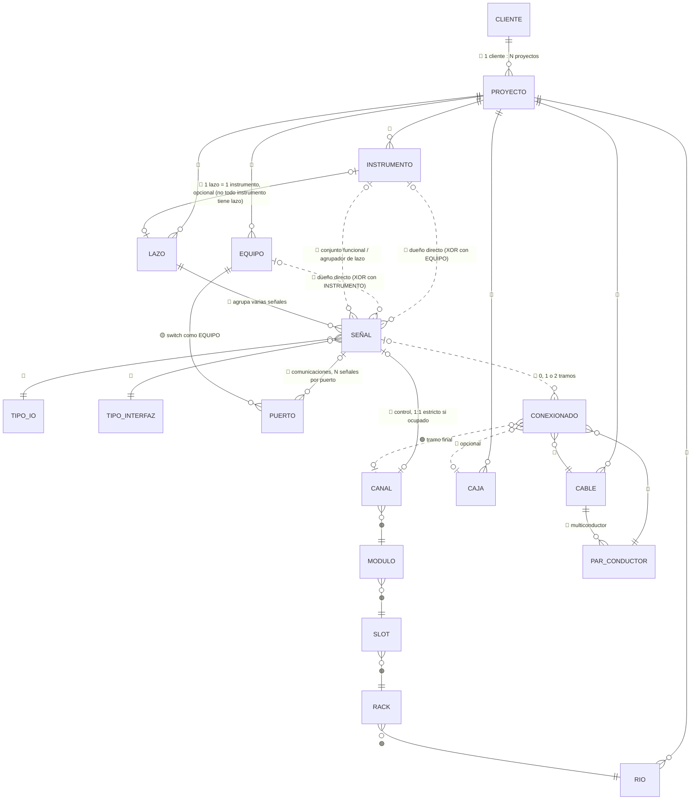

# Modelo conceptual del núcleo de SIEI

Etapa: **modelo conceptual** (entidades, propósito y cardinalidades). **No** es un modelo físico: no incluye tablas, columnas, tipos de dato, índices ni claves técnicas. Se basa en las reglas de negocio confirmadas durante la etapa de descubrimiento, documentadas en `ANALISIS_EXCEL_SIEI.md` (entregado por chat durante la conversación de análisis de los Excel de referencia; no versionado todavía en este repositorio — pregunta pendiente si conviene incorporarlo también a `docs/`).

**Leyenda de confianza** (igual que en el análisis funcional):
- 🔵 **Regla confirmada** por el usuario — prevalece sobre cualquier otra consideración.
- 🟢 **Evidencia** estructural de los Excel analizados, no contradicha por ninguna regla confirmada.
- 🟡 **Hipótesis** — no determinada todavía; no bloquea el modelo conceptual pero debe resolverse antes o durante el diseño físico.

---

## 1. Alcance de este modelo

Concepto raíz: **PROYECTO** (todo el núcleo cuelga, directa o transitivamente, de un proyecto — 🔵 datos de ingeniería exclusivos por proyecto).

Entidades cubiertas: `CLIENTE, PROYECTO, INSTRUMENTO, EQUIPO, SEÑAL, TIPO/CLASIFICACIÓN DE SEÑAL, RIO, RACK, SLOT, MÓDULO, CANAL, PUERTO, CAJA, CABLE, PAR/CONDUCTOR, CONEXIONADO, LAZO` (`PUERTO` se agregó sobre la lista mínima pedida, como extensión necesaria para señales de comunicaciones — ver 2.11b).

Explícitamente **fuera de alcance** en este documento (se modelarán en sus propios módulos más adelante): Matriz Causa-Efecto, Trazabilidad/Ingeniería previa, Documentos/Entregables/Revisiones, atributos definitivos de Cliente/Proyecto (etapas, alcance contractual, disciplinas, convenciones de nomenclatura).

---

## 2. Entidades

### 2.1 CLIENTE

**Propósito**: organización/empresa contratante, dueña de uno o más proyectos gestionados en SIEI. Es el nivel más alto de agrupación organizacional del modelo.

**Relaciones**:
| Con | Cardinalidad | Estado |
|---|---|---|
| PROYECTO | 1 : N | 🔵 confirmada (un cliente puede tener múltiples proyectos) |

🔵 **Confirmado**: todo proyecto requiere obligatoriamente un cliente — no existe proyecto sin cliente asociado. Atributos propios de CLIENTE (razón social, código interno, etc.) quedan diferidos al módulo Cliente/Proyecto.

---

### 2.2 PROYECTO

**Propósito**: contexto que delimita y aísla los datos de ingeniería de un trabajo específico; unidad central de particionamiento de todo el modelo (soporte multiproyecto).

**Relaciones**:
| Con | Cardinalidad | Estado |
|---|---|---|
| CLIENTE | N : 1 (obligatorio) | 🔵 confirmada |
| INSTRUMENTO | 1 : N | 🔵 confirmada |
| EQUIPO | 1 : N | 🔵 confirmada |
| RIO | 1 : N | 🔵 confirmada |
| CAJA | 1 : N | 🔵 confirmada |
| CABLE | 1 : N | 🔵 confirmada |
| LAZO | 1 : N | 🔵 confirmada |

`SEÑAL`, `RACK`, `SLOT`, `MÓDULO`, `CANAL`, `PAR/CONDUCTOR` y `CONEXIONADO` heredan el proyecto **transitivamente** a través de su entidad padre — no necesitan una relación directa propia con PROYECTO a nivel conceptual (si conviene como atajo de consulta a nivel físico es una decisión de diseño posterior, no una regla de negocio).

🔵 **Confirmado**: el prefijo del TAG **no** determina el proyecto — la pertenencia a PROYECTO es siempre un dato explícito en cada entidad, nunca inferido de un texto.

🟡 **Fuera de alcance de este modelo** (diferido): estructura de etapas/alcance contractual (Ingeniería/Procura/Construcción) como sub-conceptos de PROYECTO.

---

### 2.3 INSTRUMENTO

**Propósito**: dispositivo de campo con identidad de ingeniería propia (transmisor, válvula, switch de posición, solenoide, manómetro, etc.), normalmente originado desde el P&ID, que puede originar una o más señales y ser el punto de anclaje de un lazo.

**Relaciones**:
| Con | Cardinalidad | Rol | Estado |
|---|---|---|---|
| PROYECTO | N : 1 | — | 🔵 confirmada |
| SEÑAL | 1 : 0..N | "dueño directo" de la señal | 🔵 confirmada (uno de los dos orígenes posibles de una señal) |
| SEÑAL | 1 : 0..N | "conjunto funcional / agrupador de lazo" (vía `TAG_INSTRUMENTO_ASOCIADO`) | 🔵 confirmada y validada con ejemplos reales (`620-HV-5075/5084` agrupando switches y solenoides) |
| LAZO | 0..1 : 1 | — | 🔵 confirmada, **incluyendo la opcionalidad**: no todo instrumento tiene lazo. Casos confirmados sin lazo: instrumentos cuya señal es por comunicación (COM), e instrumentos que pertenecen a un equipo *vendor* (paquete de un proveedor, ya integrado/probado por el fabricante, donde SIEI no genera diagrama de lazo propio). |

🔵 **Confirmado**: `TAG_INSTRUMENTO` es único **dentro del proyecto**, no globalmente en SIEI, y **no** es la clave primaria interna — el instrumento se identifica internamente por un id propio, independiente del tag.

🔵 **Confirmado**: `PnPID` es un identificador **externo**, de una fuente de importación concreta (ej. Plant 3D en el proyecto 620) — es un atributo/referencia externa del instrumento, no su identidad interna ni una entidad propia.

**Nota de diseño importante**: no existe relación directa `INSTRUMENTO → CAJA` ni `INSTRUMENTO → RIO`. La ruta física de una señal se obtiene siempre recorriendo `SEÑAL → CONEXIONADO → …`, nunca como atajo almacenado en INSTRUMENTO.

---

### 2.4 EQUIPO

**Propósito**: activo de planta/tablero que no es un instrumento de campo en sentido ISA (ej. variador de velocidad, relé de protección de motor, UPS, switch de red), pero que puede originar señales — típicamente de estado eléctrico o de comunicaciones.

**Relaciones**:
| Con | Cardinalidad | Rol | Estado |
|---|---|---|---|
| PROYECTO | N : 1 | — | 🔵 confirmada |
| SEÑAL | 1 : 0..N | "dueño directo" de la señal | 🔵 confirmada |
| INSTRUMENTO | *(ninguna)* | — | 🔵 confirmado explícitamente: **EQUIPO no se relaciona con INSTRUMENTO** |
| LAZO | *(ninguna)* | — | 🔵 confirmado explícitamente: **EQUIPO no tiene lazo** — los lazos son exclusivos de instrumentos |

🔵 **Confirmado**: una señal originada en un EQUIPO sí participa igual del conexionado físico (cable/caja/canal) que una originada en un INSTRUMENTO — la diferencia entre ambos orígenes está en el "dueño" de la señal y en que solo el camino vía INSTRUMENTO habilita la agrupación en LAZO; el conexionado en sí es una relación de la SEÑAL, no del INSTRUMENTO/EQUIPO.

---

### 2.5 SEÑAL

**Propósito**: unidad atómica de información de instrumentación y control — un punto de dato individual (una medición, un estado, una alarma, un mando) que se origina en un instrumento o en un equipo, tiene una clasificación de tipo, y puede tener una ruta física de conexionado hacia el sistema de control.

**Relaciones**:
| Con | Cardinalidad | Rol | Estado |
|---|---|---|---|
| INSTRUMENTO **o** EQUIPO | N : 1 | "dueño directo" — **mutuamente excluyente (XOR)** | 🔵 confirmada |
| INSTRUMENTO | N : 0..1 | "conjunto funcional / agrupador de lazo" | 🔵 confirmada (exclusivo de INSTRUMENTO, nunca EQUIPO) |
| TIPO/CLASIFICACIÓN DE SEÑAL | N : 1 (×2 catálogos) | ver 2.6 | 🔵 confirmada la distinción; 🟡 hipótesis el detalle |
| CANAL | 1 : 0..1 | — | 🔵 confirmada (relación 1:1 cuando el canal está ocupado; ver 2.10) |
| CONEXIONADO | 1 : 0..2 | — | 🔵 confirmada (0, 1 o 2 tramos según exista caja intermedia) |
| LAZO | N : 0..1 | — | 🔵 confirmada (una señal pertenece a lo sumo a un lazo, a través de su instrumento agrupador) |

🔵 **Confirmado**: una señal puede originarse en un INSTRUMENTO **o** en un EQUIPO, nunca en ambos a la vez.

🟡 **Hipótesis**: una señal cuyo dueño directo es un EQUIPO (sin instrumento agrupador) — ¿puede de todas formas tener `LAZO`, o el concepto de lazo queda automáticamente excluido para ella? Se deduce que sí queda excluida (LAZO depende de INSTRUMENTO), pero no está dicho explícitamente para el caso borde de una señal-de-equipo aislada.

---

### 2.6 TIPO / CLASIFICACIÓN DE SEÑAL

**Propósito**: en el Excel actual, dos conceptos distintos se mezclaban bajo el nombre `TIPO_SENAL`. El modelo conceptual de SIEI debe separarlos explícitamente como (al menos) dos catálogos de clasificación relacionados con SEÑAL:

1. **Tipo de I/O físico**: `DI / DO / AI / AO / RTD` (más `IN / OUT` para señales de comunicaciones).
2. **Tipo/característica de la señal o interfaz**: `4-20 mA`, `4-20 mA + HART`, `120 VAC`, `COMUNICADA`, y otros según el proyecto.

**Relaciones**:
| Con | Cardinalidad | Estado |
|---|---|---|
| SEÑAL (catálogo 1: tipo I/O) | 1 : N | 🔵 confirmada la existencia como concepto separado de (2) |
| SEÑAL (catálogo 2: tipo de interfaz) | 1 : N | 🔵 confirmada (aclaración: `TIPO_SENAL` no es AI/AO/DI/DO) |

🔵 **Decisión diferida (confirmado por el usuario que no es una restricción de negocio)**: si el catálogo de tipo I/O se subdivide en "tipo de módulo físico" (DI/DO/AI/AO/RTD, señales de control) vs. "dirección de comunicación" (IN/OUT, señales COM), o se mantiene como uno solo, **es una decisión de diseño a tomar más adelante**, no una regla de negocio pendiente — no bloquea nada.

🟡 **Hipótesis**: si estos catálogos son globales de SIEI o configurables por proyecto/cliente — pendiente de la pregunta general (aún abierta) sobre qué elementos son catálogo compartido entre proyectos.

---

### 2.7 RIO

**Propósito**: gabinete/panel de entrada-salida remota (Remote I/O) — punto de concentración físico de tarjetas de control en campo, que se conecta al sistema de control central.

**Relaciones**:
| Con | Cardinalidad | Estado |
|---|---|---|
| PROYECTO | N : 1 | 🔵 confirmada |
| RACK | 1 : N | 🟢 evidencia estructural (jerarquía RIO→chasis→slot→módulo→canal vista en los 5 Excel) |
| CONEXIONADO | 1 : 0..N | 🟢 evidencia (destino final de los tramos que llegan al panel) |

---

### 2.8 RACK (chasis)

**Propósito**: subdivisión física dentro de un RIO — el bastidor/chasis que aloja los módulos de I/O (visto en Excel como "CHASIS 0", "CHASIS 1", etc.).

**Relaciones**:
| Con | Cardinalidad | Estado |
|---|---|---|
| RIO | N : 1 | 🟢 evidencia |
| SLOT | 1 : N | 🟢 evidencia |

---

### 2.9 SLOT

**Propósito**: posición física dentro de un rack/chasis donde se instala (o podría instalarse) un módulo de I/O.

**Relaciones**:
| Con | Cardinalidad | Estado |
|---|---|---|
| RACK | N : 1 | 🟢 evidencia |
| MÓDULO | 1 : 0..1 | 🟢 evidencia (un slot puede estar vacío o tener un módulo instalado) |

---

### 2.10 MÓDULO

**Propósito**: tarjeta física de I/O instalada en un slot; su modelo de hardware determina su tipo (DI/DO/AI/AO/RTD) y su capacidad de canales.

**Relaciones**:
| Con | Cardinalidad | Estado |
|---|---|---|
| SLOT | N : 1 | 🟢 evidencia |
| CANAL | 1 : N | 🔵 confirmada (la cantidad depende del modelo/catálogo de hardware, **no** es una regla fija universal por tipo de I/O — ej. hoy DI/DO=16, AI/AO=8, pero eso es característica del módulo, no constante de SIEI) |

🟡 **Hipótesis**: si el "modelo de módulo" (fabricante, referencia, canales máximos por tipo) debe modelarse como un catálogo de referencia propio (`CATÁLOGO_MODULO`) relacionado con MÓDULO, o si basta con que MÓDULO tenga esa característica embebida — no es una entidad pedida explícitamente en el alcance de este documento, se deja como nota para el diseño físico.

---

### 2.11 CANAL

**Propósito**: punto físico de conexión de I/O dentro de un módulo (ej. canal 0 a 15) — la unidad más pequeña de la jerarquía `RIO → RACK → SLOT → MÓDULO → CANAL`, y el punto donde una señal físicamente "entra" al sistema de control.

**Relaciones**:
| Con | Cardinalidad | Estado |
|---|---|---|
| MÓDULO | N : 1 | 🟢 evidencia |
| SEÑAL | 1 : 0..1 | 🔵 confirmada — **un canal recibe una sola señal** (1:1 estricto cuando está ocupado); dos señales en el mismo canal vigente = conflicto/inconsistencia, no un caso válido |

**Decisión conceptual**: no se modela una entidad "IO" separada — la asignación de I/O física es directamente la relación `SEÑAL ── CANAL`. Esto simplifica una hipótesis que había quedado abierta en la ronda anterior del análisis (`SEÑAL──IO──CANAL`), colapsándola en una sola relación directa. Esta relación aplica **solo a señales de control** (hardwired); las señales de comunicaciones usan `PUERTO` en su lugar — ver 2.11b.

---

### 2.11b PUERTO (extensión: conectividad de señales de comunicaciones)

🔵 **Regla confirmada**: las señales de comunicaciones (COM) **no** se conectan a un `CANAL` como las señales de control — usan un medio distinto y con una cardinalidad distinta. El cable de una señal COM suele ser un **patch/cable de red que concentra varias señales** sobre una misma conexión física (ej. Ethernet/IP, Modbus TCP transportando múltiples puntos de datos lógicos por un mismo puerto) — a diferencia de `CANAL`, que es siempre dedicado 1:1.

**Propósito de `PUERTO`**: punto de conexión de red (ej. puerto de un switch industrial) — el equivalente funcional de `CANAL` para señales de comunicaciones, pero con una diferencia clave: **puede concentrar varias señales a la vez**, no una sola.

**Relaciones**:
| Con | Cardinalidad | Estado |
|---|---|---|
| EQUIPO (rol "switch de red") | N : 1 | 🟡 hipótesis de modelado razonable — la evidencia del Excel muestra el `SWITCH` identificado con un tag del mismo formato que otros equipos (ej. `620-LSW-5041`), consistente con tratarlo como una instancia de `EQUIPO` y no como una entidad nueva; no confirmado explícitamente por el usuario |
| SEÑAL | 1 : 0..N | 🔵 confirmada — **un puerto puede concentrar varias señales** (a diferencia de `CANAL`, que es 1:1) |

`SEÑAL` se conecta entonces a **`CANAL` (control) o a `PUERTO` (comunicaciones)** — un tercer caso de exclusión mutua en el modelo (además del origen INSTRUMENTO/EQUIPO): el "medio de conexión física/lógica" de una señal es uno u otro, nunca ambos.

🟡 **Hipótesis abierta**: si el tramo de `CONEXIONADO` que llega a un puerto sigue usando `CABLE`/`PAR-CONDUCTOR` de la misma forma que el conexionado de control (un par dedicado por señal), o si para cables de red multi-señal el concepto `PAR/CONDUCTOR` no aplica de la misma manera (todas las señales comparten el mismo medio físico sin división por conductor). Requiere más detalle — diferido al diseño del módulo de comunicaciones.

---

### 2.12 CAJA

**Propósito**: caja de conexiones / junction box intermedia en campo, donde convergen los cables de una o varias señales antes de continuar hacia el RIO. Es **opcional** en la ruta de una señal.

**Relaciones**:
| Con | Cardinalidad | Estado |
|---|---|---|
| PROYECTO | N : 1 | 🔵 confirmada |
| CONEXIONADO | 1 : 0..N | 🔵 confirmada (una caja puede ser punto intermedio de varios tramos, de distintas señales) |

🔵 **Confirmado**: no existe relación directa `CAJA ── INSTRUMENTO` ni `CAJA ── RIO` — la caja participa siempre a través de `CONEXIONADO`.

---

### 2.13 CABLE

**Propósito**: elemento físico de cableado (con una capacidad de conductores/pares determinada) que transporta una o más señales a lo largo de un tramo de la ruta de conexionado (instrumento/equipo↔caja, caja↔RIO, o instrumento/equipo↔RIO directo).

**Relaciones**:
| Con | Cardinalidad | Estado |
|---|---|---|
| PROYECTO | N : 1 | 🔵 confirmada |
| PAR/CONDUCTOR | 1 : N | 🔵 confirmada — cable multiconductor/multipar |
| CONEXIONADO | 1 : N | 🔵 confirmada — un mismo cable físico puede materializar el tramo de varias señales distintas (cada una por su propio par), por eso `CABLE ── CONEXIONADO` es 1:N y no 1:1 |

🔵 **Confirmado explícitamente**: **no** debe modelarse `CABLE → 1 SEÑAL` — un cable puede transportar varias señales mediante sus pares/conductores.

---

### 2.14 PAR / CONDUCTOR

**Propósito**: unidad interna de un cable multiconductor/multipar — el hilo, par trenzado o conductor específico dentro de un cable físico, que efectivamente transporta la señal en un tramo de conexionado. Puede estar libre (de reserva) o asignado.

**Relaciones**:
| Con | Cardinalidad | Estado |
|---|---|---|
| CABLE | N : 1 | 🔵 confirmada |
| CONEXIONADO | 1 : 0..1 | 🟢/🔵 — un par se usa, como máximo, en un tramo/señal a la vez; puede no estar asignado (par de reserva) |

---

### 2.15 CONEXIONADO

**Propósito**: entidad "puente" que materializa **un tramo** de la ruta física de una señal. Es el mecanismo por el cual se reconstruye la ruta completa de una señal (instrumento/equipo → [caja opcional] → RIO) **sin** que la señal, el instrumento o el equipo tengan campos redundantes de caja/RIO — la ruta se obtiene siempre recorriendo el conexionado, nunca leyendo un atajo almacenado en otra entidad.

**Relaciones**:
| Con | Cardinalidad | Estado |
|---|---|---|
| SEÑAL | N : 1 | 🔵 confirmada — cada tramo pertenece a una señal; una señal tiene 0, 1 o 2 tramos |
| CABLE | N : 1 | 🔵 confirmada — cada tramo recorre un cable físico |
| PAR/CONDUCTOR | N : 1 | 🔵 confirmada — el tramo usa específicamente ese par/conductor dentro del cable |
| CAJA | N : 0..1 | 🔵 confirmada — el tramo puede tener una caja en un extremo (opcional) |
| CANAL | N : 0..1 | 🟢/🔵 — el tramo final (el que llega al RIO) se conecta a un canal específico; el tramo instrumento/equipo→caja no llega directamente a un canal |

**Cardinalidad clave que resume toda la ruta**: `SEÑAL (1) ── (0..2) CONEXIONADO` 🔵 — 0 tramos (señal sin conexionado registrado aún), 1 tramo (`Caso A`: instrumento/equipo → RIO directo), o 2 tramos (`Caso B`: instrumento/equipo → caja → RIO).

---

### 2.16 LAZO

**Propósito**: conjunto documental/funcional que agrupa todas las señales relacionadas con **un** instrumento (incluidas las de su conjunto funcional asociado — ej. switches y solenoides de una válvula), usado para generar el entregable "diagrama de lazo". Tiene un identificador interno estable y, por separado, un código de documento visible.

**Relaciones**:
| Con | Cardinalidad | Estado |
|---|---|---|
| PROYECTO | N : 1 | 🔵 confirmada |
| INSTRUMENTO | N : 1 | 🔵 confirmada — **un lazo es siempre de un solo instrumento** (nunca de varios) |
| SEÑAL | 1 : N | 🔵 confirmada — un lazo agrupa varias señales (las del instrumento como dueño directo, más las de su conjunto funcional asociado) |

🔵 **Confirmado**: `código_documento_visible ≠ identificador_interno` — el lazo tiene un id técnico estable para relaciones internas, y por separado un código de documento (ej. de plano) visible para el usuario, que respeta convenciones de cliente/proyecto (diferidas al módulo de Documentos).

🔵 **Confirmado (nota de alcance, fuera de las 16 entidades pero relevante)**: un documento de tipo "plano de diagrama de lazo" puede contener **varios lazos** (`PLANO 1 : N LAZO`) — cada lazo sigue siendo de un único instrumento; varios instrumentos en un mismo plano son varios lazos distintos compartiendo un documento, no un lazo con varios instrumentos.

🟡 **Hipótesis**: si todo INSTRUMENTO tiene obligatoriamente un LAZO, o solo algunos (ver 2.3).

---

## 3. Qué conceptos de Excel NO deberían convertirse en entidades independientes

| Concepto en Excel | Por qué no es una entidad propia |
|---|---|
| `IMPORT_PNID` | Staging efímero de una importación puntual — no es dato persistente del núcleo. |
| `SENALES_CONTROL` / `SENALES_COM` (salidas de Power Query) | Son particiones por origen de una misma entidad `SEÑAL` — en SIEI, `SEÑAL` es una única entidad con atributos/clasificación (2.6), no dos tablas separadas por tipo de origen. |
| `MASTER_SENALES` (unión de las dos anteriores) | Colapsa igualmente en la entidad única `SEÑAL`; la capa de "estado de revisión" que trae podría ser un atributo de `SEÑAL`, pero la hoja en sí no es una entidad. |
| `RESUMEN_SENALES`, `RESUMEN_CONTEO_IO`, `RESUMEN`, `COMPARATIVO_WSP`, `LISTA_IO`, `LISTA_COM`, `DASHBOARD` | Reportes/vistas calculadas a partir del modelo — se generan, no se almacenan como entidades propias. |
| "WSP" | No es una entidad — es un caso particular del concepto genérico de "ingeniería previa/procedencia", diferido a un módulo de trazabilidad futuro, fuera de este núcleo. |
| `CODIGO_LAZO` como clave | No es la identidad interna del lazo — es su código de documento visible (ver 2.16), conceptualmente distinto del id interno. |
| `TAG_INSTRUMENTO` / `TAG_SENAL` como clave | Son atributos naturales y potencialmente mutables — la identidad interna de cada entidad es siempre un id propio, no el tag. |
| `TIPO_SENAL` como columna única | Debe descomponerse en (al menos) dos catálogos de clasificación relacionados con `SEÑAL` (ver 2.6), no una sola columna ambigua que mezcle tipo de I/O con tipo de interfaz. |
| `PnPID` como identidad universal | Es un atributo/referencia externa de `INSTRUMENTO`, específico de una fuente de importación — no una entidad ni la PK. |
| `VALIDACIONES` (log de auditoría) | Podría modelarse a futuro como un registro de eventos asociado a `INSTRUMENTO`/`SEÑAL`, pero no forma parte del núcleo estructural de este documento. |
| `Carátula` / `Índice` (portada de cada libro) | Son metadatos de documento/entregable — pertenecen conceptualmente a un futuro módulo de Documentos, no al núcleo de ingeniería. |
| `MATRIZ` (causa-efecto) | Diferido a su propio módulo (Matriz Causa-Efecto), no forma parte de este núcleo. |
| `CLAVE DE MÓDULO` (`gabinete|chasis|slot`, usada para conteo en `LISTA DE SEÑALES`) | Es una clave compuesta derivada para agregación/reporte — se resuelve navegando la jerarquía `RIO → RACK → SLOT → MÓDULO` ya modelada, no requiere entidad propia. |
| Hoja `EQUIPOS` (catálogo con `TAG_EQUIPO_INST`, `PANEL`, `SISTEMA`, `NODO`, `P&ID`) | Corresponde directamente a la entidad `EQUIPO` ya incluida en este modelo — no es un concepto adicional. |

---

## 4. Diagrama conceptual (Mermaid)

---

## 5. Resumen de cardinalidades del núcleo

| Relación | Cardinalidad | Estado |
|---|---|---|
| CLIENTE ── PROYECTO | 1 : N, cliente obligatorio | 🔵 |
| PROYECTO ── INSTRUMENTO | 1 : N | 🔵 |
| PROYECTO ── EQUIPO | 1 : N | 🔵 |
| PROYECTO ── RIO / CAJA / CABLE / LAZO | 1 : N (cada una) | 🔵 |
| INSTRUMENTO ── SEÑAL (dueño directo) | 1 : 0..N | 🔵 |
| EQUIPO ── SEÑAL (dueño directo) | 1 : 0..N | 🔵 |
| INSTRUMENTO ── SEÑAL (dueño **o** equipo dueño) | XOR | 🔵 |
| INSTRUMENTO ── SEÑAL (conjunto funcional / lazo) | 1 : 0..N | 🔵 |
| EQUIPO ── INSTRUMENTO | *(sin relación)* | 🔵 |
| EQUIPO ── LAZO | *(sin relación)* | 🔵 |
| INSTRUMENTO ── LAZO | 0..1 : 1, **opcional** (no todo instrumento tiene lazo: instrumentos por COM o de equipo *vendor* no lo tienen) | 🔵 |
| LAZO ── SEÑAL | 1 : N | 🔵 |
| SEÑAL ── TIPO_IO / TIPO_INTERFAZ | N : 1 (cada catálogo) | 🔵 (subdivisión interna de TIPO_IO: decisión de diseño diferida, no de negocio) |
| SEÑAL ── CANAL (señales de control) | 0..1 : 0..1 (1:1 si ocupado) | 🔵 |
| SEÑAL ── PUERTO (señales de comunicaciones) | 0..1 : 0..N (un puerto concentra varias señales) | 🔵 |
| CANAL ── MÓDULO ── SLOT ── RACK ── RIO | N : 1 en cada nivel | 🟢 |
| MÓDULO ── CANAL | 1 : N (capacidad según catálogo hardware) | 🔵 |
| EQUIPO (switch) ── PUERTO | 1 : N | 🟡 (switch como EQUIPO: hipótesis de modelado razonable) |
| SEÑAL ── CONEXIONADO | 1 : 0..2 | 🔵 |
| CONEXIONADO ── CABLE | N : 1 | 🔵 |
| CONEXIONADO ── PAR/CONDUCTOR | N : 1 | 🔵 (🟡 si aplica igual a cables de red/patch multi-señal) |
| CONEXIONADO ── CAJA | N : 0..1 | 🔵 |
| CONEXIONADO ── CANAL | N : 0..1 | 🟢 |
| CABLE ── PAR/CONDUCTOR | 1 : N | 🔵 |
| CABLE ── CONEXIONADO | 1 : N | 🔵 |
| CAJA ── CONEXIONADO | 1 : 0..N | 🔵 |

---

## 6. Hipótesis abiertas (no bloqueantes) que podrían afectar cardinalidades

Resueltas en la ronda de validación de este modelo: obligatoriedad CLIENTE↔PROYECTO, opcionalidad INSTRUMENTO↔LAZO, y la conectividad de señales COM (resuelta con la nueva entidad `PUERTO`, ver 2.11b). La subdivisión de `TIPO_IO` se aclaró como decisión de diseño diferida, no como pregunta de negocio. Quedan abiertas:

1. **`EQUIPO` (rol "switch de red") ── `PUERTO`**: ¿un switch de comunicaciones se modela realmente como una instancia de `EQUIPO` (hipótesis razonable por el formato de tag observado en la evidencia), o merece su propio concepto separado?
2. **`CONEXIONADO`/`PAR-CONDUCTOR` para cables de red multi-señal (patch)**: ¿el tramo hacia un `PUERTO` sigue usando un `PAR/CONDUCTOR` dedicado por señal (como el conexionado de control), o el concepto de "par" no aplica igual cuando varias señales comparten el mismo medio físico sin división por conductor? Esta es la pregunta más relevante que dejó abierta tu explicación sobre los patch cords — necesita más detalle del módulo de comunicaciones para resolverse.
3. **Catálogos compartidos**: si `TIPO_IO`, `TIPO_INTERFAZ` o el catálogo de módulos de hardware son globales de SIEI o configurables por cliente/proyecto — pregunta general aún diferida.
