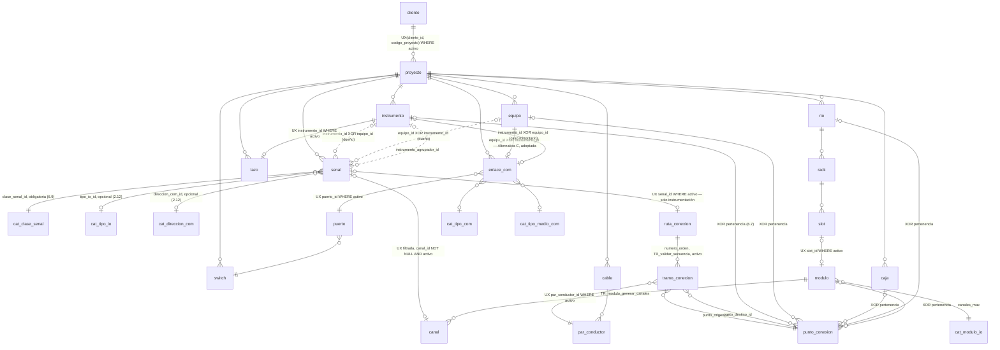

# Modelo físico para SQL Server — núcleo de SIEI

**Estado: modelo físico del núcleo APROBADO, sin decisiones estructurales críticas pendientes — todavía NO se genera `001_initial_schema.sql`.** Traduce `MODELO_LOGICO_SIEI.md` (cerrado) a tablas, tipos de dato, PK/FK, `NULL`/`NOT NULL`, `UNIQUE`, `CHECK`, índices, borrado lógico, auditoría y triggers **documentados pero no implementados**. **No** contiene `CREATE TABLE` ejecutable. No se ha creado ninguna base de datos, backend ni cambio de frontend. Row-Level Security **no se implementa en esta etapa** (sección 4). Comunicaciones (SWITCH/PUERTO/ENLACE_COM, Alternativa C), terminaciones (PUNTO_CONEXION, Alternativa B) y clasificación explícita de señal (CAT_CLASE_SENAL) quedan **adoptadas** — secciones 5, 6.7 y 6.9. Alimentación eléctrica del instrumento queda **diferida deliberadamente** a una etapa dedicada — sección 6.8. **Corrección de esta ronda**: `PUNTO_CONEXION` ahora incluye `EQUIPO` en su pertenencia (6.7), el origen del primer tramo se valida contra el dueño exacto de la señal (6.7b), la continuidad dentro de una caja se confirmó con evidencia sin cambiar la regla (6.7c), y se agregó validación de coherencia entre el destino físico de la ruta y `SEÑAL.canal_id` (6.7d). **Revisión de implementabilidad en SQL Server (7.1)**: los 8 triggers del núcleo quedaron reescritos con sintaxis T-SQL válida (`AFTER UPDATE` + `UPDATE(columna)`, nunca `AFTER UPDATE OF columna`), cada uno en una sola tabla, y con lógica set-based/multi-row verificada — ninguna regla de negocio cambió.

**Leyenda**: 🔵 regla ya confirmada · 🟢 evidencia del Excel o práctica estándar de SQL Server · 🟡 decisión física que requiere tu aprobación.

---

## 0. Convenciones

Igual que antes: `snake_case`, esquemas `nucleo`/`cat`, `id BIGINT IDENTITY(1,1)` como PK, nomenclatura de restricciones `PK_/FK_/UQ_/CK_/IX_/UX_/TR_<tabla>_<detalle>`.

---

## 1. Auditoría

Sin cambios: `created_at DATETIME2 NOT NULL DEFAULT SYSUTCDATETIME()`, `updated_at DATETIME2 NULL` en toda tabla de `nucleo`/`cat`. `created_by`/`updated_by` diferidos hasta que exista una tabla de usuarios — se agregarán con `ALTER TABLE` cuando corresponda, sin romper lo existente.

---

## 2. Borrado lógico — confirmado y extendido

`activo BIT NOT NULL DEFAULT 1` en las entidades cuya vigencia puede cambiar. Lista confirmada (🔵 aprobada explícitamente en esta ronda, incluida la extensión que antes era propuesta):

`cliente, proyecto, instrumento, equipo, senal, rio, rack, slot, modulo, canal, caja, cable, lazo, switch, puerto, enlace_com, ruta_conexion, tramo_conexion`.

🔵 **`ruta_conexion` y `tramo_conexion` se agregan a esta lista en esta ronda** (antes excluidas) — necesario para conservar el historial de rutas de conexionado que dejan de estar vigentes sin bloquear permanentemente el `par_conductor` que usaban. Ver desarrollo completo en sección 2.2.

**Sin `activo`**: `par_conductor` (el estado de "libre/ocupado" de un par se deriva de si existe un `tramo_conexion` **activo** que lo referencia — no necesita su propio flag) y todos los catálogos `cat.*`.

### 2.1 Liberación de recurso ocupado al desactivar — confirmado (ya no es una pregunta abierta)

Regla general aplicada de forma consistente: **toda restricción de exclusividad de un recurso físico (canal, puerto) se evalúa únicamente contra registros/asignaciones activos**, mediante índice único filtrado con `activo = 1`. Ejemplo pedido explícitamente:

```
SEÑAL A → canal_id = 7 → activo = 0   (se desactiva, el registro histórico permanece)
SEÑAL B → canal_id = 7 → activo = 1   (ahora sí es posible, porque A ya no cuenta)
```

Se implementa con `UX_senal_canal_id ON senal(canal_id) WHERE canal_id IS NOT NULL AND activo = 1` — el motor solo compara contra filas activas; una fila desactivada dejó de "ocupar" el canal a efectos de la restricción, sin que su historial se pierda (`SELECT` normal sigue devolviendo la fila con `activo = 0`).

El mismo mecanismo aplica a la ocupación de `PUERTO` — pero, como se ve en la sección 5, con el diseño recomendado la exclusividad de puerto ya no se evalúa por señal individual sino por `ENLACE_COM` (una fila por equipo), lo cual simplifica este punto en vez de duplicarlo.

### 2.2 Liberación histórica de PAR_CONDUCTOR vía RUTA_CONEXION/TRAMO_CONEXION ✅ Aprobado

Mismo mecanismo de la sección 2.1, aplicado ahora a `ruta_conexion`/`tramo_conexion`:

```
RUTA_CONEXION (señal A) → activo = 0   (la ruta deja de estar vigente, el historial permanece)
TRAMO_CONEXION (de esa ruta) → activo = 0   (cada tramo hijo se desactiva junto con su ruta)
PAR_CONDUCTOR → queda libre de nuevo, porque ya no hay ningún TRAMO_CONEXION activo que lo use
RUTA_CONEXION (señal B, nueva) → puede usar el mismo PAR_CONDUCTOR
```

**Cambios sobre el diseño anterior:**

- `ruta_conexion` y `tramo_conexion` agregan `activo BIT NOT NULL DEFAULT 1`.
- `UX_ruta_conexion_senal_id ON ruta_conexion(senal_id) WHERE activo = 1` — reemplaza el `UNIQUE` simple anterior: una señal puede tener como máximo **una ruta activa**, pero conserva sus rutas antiguas con `activo = 0`.
- `UX_tramo_conexion_par_conductor_id ON tramo_conexion(par_conductor_id) WHERE activo = 1` — reemplaza el `UNIQUE` simple: un par participa en como máximo **un tramo activo**, quedando libre en cuanto ese tramo se desactiva.
- `UX_tramo_conexion_orden ON tramo_conexion(ruta_conexion_id, numero_orden) WHERE activo = 1` — el número de orden es único solo entre los tramos **activos** de una misma ruta (una ruta desactivada puede haber tenido, en su momento, la misma numeración que la ruta activa actual, sin conflicto).

**Consistencia entre `ruta_conexion` y sus `tramo_conexion` hijos — mecanismo explícito, no dejado a la aplicación:**

Se agrega un cuarto trigger, `TR_ruta_conexion_desactivar_tramos` (`AFTER UPDATE ON ruta_conexion`, usando `UPDATE(activo)` para detectar el cambio de columna — sintaxis válida en T-SQL, ver 7.1): desactiva automáticamente (`UPDATE ... SET activo = 0`, nunca `DELETE`) todos los `tramo_conexion` activos de esa ruta. Esto evita el estado inconsistente de "ruta inactiva con tramos que siguen contando como ocupados" si la aplicación desactivara la ruta sin acordarse de desactivar sus tramos.

🟡 **Asimetría deliberada, señalada para tu conocimiento**: la desactivación **sí** se propaga automáticamente (ruta → tramos), pero la reactivación **no** — reactivar una `ruta_conexion` (`activo` `0→1`) no reactiva sus tramos automáticamente, porque el `par_conductor` que usaban podría ya estar ocupado por otra ruta activa en el ínterin. Reconectar una ruta antigua requiere crear tramos nuevos (o validar explícitamente que los pares originales siguen libres), no es una operación de un solo paso. Esto es coherente con no "resucitar" silenciosamente una ocupación que ya no es segura.

---

## 3. Nota técnica SQL Server sobre `UNIQUE` con `NULL`

Sin cambios: SQL Server admite como máximo una fila `NULL` en un `UNIQUE` estándar — toda columna `UNIQUE` nulable de este modelo usa índice único filtrado (`WHERE columna IS NOT NULL [AND activo = 1]`).

---

## 4. Aislamiento multiproyecto — preparado para RLS futuro, sin implementarla

Sin cambios de fondo respecto a la ronda anterior — se mantiene íntegro el mecanismo de FK compuesta `(hijo_id, proyecto_id) → padre(id, proyecto_id)` en toda relación padre-hijo de `nucleo`, y el ejemplo ya documentado de por qué una `SEÑAL` del Proyecto A no puede enlazar con un `INSTRUMENTO`/`CANAL`/`CABLE`/`CAJA`/`RIO` del Proyecto B. Se actualiza la lista de FKs afectadas por el rediseño de comunicaciones (sección 5): `enlace_com.equipo_id`, `enlace_com.puerto_id`, `puerto.switch_id`; y por el rediseño de terminaciones (6.7): `punto_conexion.instrumento_id`/`equipo_id`/`caja_id`/`rio_id`/`modulo_id`, `tramo_conexion.punto_origen_id`/`punto_destino_id` — todas compuestas contra `proyecto_id`, mismo mecanismo, sin excepción.

`PROYECTO` sigue como unidad de autorización futura (no `CLIENTE`); relación prevista `USUARIO → USUARIO_PROYECTO → PROYECTO`, no diseñada todavía.

---

## 5. Comunicaciones: SWITCH / PUERTO / ENLACE_COM / SEÑAL COM — comparación revisada

### 5.1 Evidencia del Excel antes de decidir (pedida explícitamente)

Se revisaron las 771 filas de `SENALES_COM`/`COM` en `02_MASTER_IO_620.xlsm`:

- Las columnas `SWITCH` y `PUERTO` **existen a nivel de fila de señal COM**, pero están **vacías en el 100% de las filas** (0/771) — nunca se llegó a capturar esa granularidad en la práctica.
- En cambio, `TIPO_COM` y `TIPO_CABLE` **sí** están pobladas, y se repiten **idénticas para todas las señales del mismo EQUIPO**. Ejemplo real: el equipo `620-AFM-5005` (variador de velocidad) tiene 6 señales COM (`RDY`, `REM`, `ESP`, `RUN`, `FAL`, …); las 6 filas comparten exactamente el mismo `RIO='620-PCC-5006'`, `TIPO_COM='Red eléctrica DLR Ethernet/IP'`, `TIPO_CABLE='CABLE S/UTP CAT. 6A'`, `PANEL='620-AFM-5005'`.
- De 770 señales COM, **0** tienen `TAG_INSTRUMENTO` poblado sin `EQUIPO` — es decir, en este proyecto **toda** señal COM está anclada a un `EQUIPO`, nunca directamente a un `INSTRUMENTO`.

**Lectura de esta evidencia**: el medio físico de comunicación (`TIPO_COM`/`TIPO_CABLE`) es, en la práctica, un dato **del enlace del equipo**, repetido de forma redundante en cada fila de señal porque la estructura plana del Excel no tenía dónde más ponerlo — exactamente el patrón de duplicación que preguntas si conviene evitar. Esto respalda directamente tu hipótesis (Alternativa C) y **no** hay evidencia en este proyecto de que dos señales del mismo equipo usen puertos distintos, ni de señales COM sin equipo. La ausencia de casos "instrumento con red nativa" en este proyecto no significa que no existan — confirmaste que sí ocurren, aunque son minoría (ver 5.6).

### 5.2 Elementos que no cambian

- **`SWITCH`**: infraestructura, `id`, `proyecto_id`, `tag_switch` (`UQ` por proyecto), `descripcion`, `marca_modelo`, `activo`.
- **`PUERTO`**: `id`, `proyecto_id`, `switch_id` (FK compuesta, `NOT NULL`), `numero_puerto` (`UQ (switch_id, numero_puerto) WHERE activo = 1`), `activo`. `SWITCH (1) ── (N) PUERTO`.
- **Origen de la señal**: `senal.instrumento_id` / `senal.equipo_id` (Problema 1, XOR) — no cambia con ninguna alternativa de esta sección.

### 5.3 Alternativa A — `senal.puerto_id` directo (ya presentada, ahora con la objeción incorporada)

```
SEÑAL COM ──(puerto_id)──> PUERTO ──(switch_id)──> SWITCH
```

Objeción confirmada por la evidencia (5.1): si un equipo tiene 6 señales COM, las 6 filas de `senal` repetirían el mismo `puerto_id` — exactamente la duplicación de un hecho que en realidad pertenece al enlace físico del equipo, no a cada señal individual.

### 5.4 Alternativa B — `ASIGNACION_COM` señal↔puerto con historial (ya presentada)

Resuelve la trazabilidad temporal, pero **hereda el mismo problema de fondo que A**: seguiría siendo una fila por señal (`senal_id, puerto_id`), repitiendo el mismo `puerto_id` una vez por cada señal del equipo — solo que ahora en una tabla aparte. No corrige la causa real de la duplicación, que es modelar la conexión al nivel equivocado (señal en vez de equipo).

### 5.5 Alternativa C — conexión física a nivel de EQUIPO (recomendada)

```
EQUIPO ──(1:0..1)──> ENLACE_COM ──(N:1)──> PUERTO ──(N:1)──> SWITCH
EQUIPO ──(1:0..N)──> SEÑAL (COM)                                    [ya existente, Problema 1]
```

**Tabla nueva `nucleo.enlace_com`** — actualizada con tu confirmación del punto 2 (un instrumento puede comunicarse directamente, aunque sea el caso menos frecuente):

| Columna | Tipo | Null | Restricción |
|---|---|---|---|
| `id` | BIGINT IDENTITY | NOT NULL | PK, `UQ (id, proyecto_id)` |
| `proyecto_id` | BIGINT | NOT NULL | FK → `proyecto(id)` |
| `equipo_id` | BIGINT | NULL | FK compuesta → `equipo(id, proyecto_id)` — rol "dueño del enlace"; `UX (equipo_id) WHERE equipo_id IS NOT NULL AND activo = 1` |
| `instrumento_id` | BIGINT | NULL | FK compuesta → `instrumento(id, proyecto_id)` — rol "dueño del enlace", caso poco frecuente pero real (5.6); `UX (instrumento_id) WHERE instrumento_id IS NOT NULL AND activo = 1` |
| `puerto_id` | BIGINT | NOT NULL | FK compuesta → `puerto(id, proyecto_id)`; `UX (puerto_id) WHERE activo = 1` — un puerto en uso por un solo enlace activo a la vez |
| `tipo_com_id` | BIGINT | NULL | FK → `cat.cat_tipo_com(id)` — protocolo (ej. "Modbus TCP/IP", "Ethernet/IP DLR"), evidencia directa de la columna `TIPO_COM` del Excel |
| `tipo_medio_id` | BIGINT | NULL | FK → `cat.cat_tipo_medio_com(id)` — medio físico (ej. "UTP Cat.6A", "Fibra óptica", "Patch cord", "RS-485"), evidencia directa de `TIPO_CABLE` |
| `tag_medio` | NVARCHAR(50) | NULL | identificador opcional del cable/patch cord físico, si el proyecto lo rotula (ej. para inventario/BOM) — sin ser una entidad `CABLE` completa, ver 5.8 |
| `activo` | BIT | NOT NULL | `DEFAULT 1` |
| `created_at`/`updated_at` | DATETIME2 | NOT NULL/NULL | |

`CK_enlace_com_origen_xor`: exactamente uno de (`equipo_id`, `instrumento_id`) no nulo — mismo patrón que `CK_senal_origen_xor` (Problema 1).

**Cómo las múltiples señales COM de un equipo se relacionan con este enlace, sin duplicar la conexión física**: no llevan ninguna FK propia hacia `puerto`/`switch`. Se navega:

```sql
SELECT s.tag_senal, sw.tag_switch, p.numero_puerto, ec.tipo_medio_id
FROM senal s
JOIN equipo e ON e.id = s.equipo_id
JOIN enlace_com ec ON ec.equipo_id = e.id AND ec.activo = 1
JOIN puerto p ON p.id = ec.puerto_id
JOIN switch sw ON sw.id = p.switch_id
WHERE e.tag_equipo = '620-AFM-5005' AND e.proyecto_id = @proyecto_id;
```

Un solo `JOIN` extra (`enlace_com`) resuelve el puerto/switch de **todas** las señales del equipo a la vez — sin ninguna columna repetida en `senal`. `senal.puerto_id` **desaparece** del modelo (ya no es necesaria).

**Cómo se representa el switch**: sin cambios — `PUERTO.switch_id → SWITCH.id`; lo único que cambia es quién referencia al puerto (`enlace_com`, no `senal`).

**Cómo se llega desde la señal al equipo que la origina**: sin cambios — `senal.equipo_id` (o `instrumento_id` si el origen fuera un instrumento, ver 5.6). Origen y medio siguen desacoplados, ahora de forma más limpia porque el medio ni siquiera toca la tabla `senal`.

### 5.6 Origen del enlace: EQUIPO o INSTRUMENTO — resuelto con tu confirmación

Confirmaste que un instrumento **sí** puede comunicarse directamente, aunque es el caso menos frecuente; el patrón habitual es distinto: varios instrumentos concentran sus señales en un **equipo vendor** (paquete de un fabricante, fuera del alcance de nuestra ingeniería de detalle — no documentamos su cableado interno), y es ese equipo vendor el que sale por COM hacia el sistema de control. Eso último **ya está cubierto** sin cambios: el equipo vendor se modela como un `EQUIPO` normal, con su propio `ENLACE_COM` — SIEI no necesita saber qué instrumentos alimenta internamente ese paquete, exactamente como pediste que quedara fuera de alcance.

Lo que sí cambia es el caso minoritario del instrumento con comunicación directa: `enlace_com` ahora acepta `equipo_id` **o** `instrumento_id` (nunca ambos), mismo patrón XOR que `senal` (Problema 1). Con esto:

- Instrumento con enlace directo → `enlace_com.instrumento_id` poblado, `equipo_id` nulo.
- Equipo (propio o "vendor") con enlace → `enlace_com.equipo_id` poblado, `instrumento_id` nulo.
- Instrumentos que alimentan un equipo vendor por cableado interno no documentado → no tienen `enlace_com` propio; el enlace es del equipo vendor.

### 5.7 Redundancia de red — confirmada como real, pero **no se modela todavía**

Confirmaste que sí existen proyectos con redundancia de red (doble enlace por equipo/instrumento), pero pediste explícitamente no abrir la estructura de más por ahora. Se mantiene entonces `0..1`: como máximo un `enlace_com` activo por equipo o por instrumento (`UX ... WHERE ... AND activo = 1`). Cuando un proyecto real lo requiera, es una extensión aditiva (quitar ese índice único filtrado, pasar a `0..N`) — no un rediseño de lo ya construido.

### 5.8 Cable/patch cord de comunicaciones: ¿reutilizar `CABLE` o una abstracción propia? — comparación pedida explícitamente

| Alternativa | Descripción | Ventajas | Desventajas |
|---|---|---|---|
| **Reutilizar `CABLE`** con una clasificación/tipo (`cable.dominio = 'INSTRUMENTACION'/'COMUNICACIONES'`) | El enlace de comunicaciones referenciaría un `cable_id` igual que el conexionado de instrumentación. | Una sola tabla de "cables" en todo el sistema; potencial reutilización de un futuro módulo de inventario/BOM de cables. | Mezcla dos semánticas distintas en una tabla: `CABLE` de instrumentación existe **para** tener `PAR_CONDUCTOR`s numerados (su razón de ser); un patch cord de comunicaciones normalmente **no** se gestiona por par/conductor (🔵 tu aclaración explícita). Forzaría `capacidad_conductores` y la relación con `PAR_CONDUCTOR` a ser opcionales/sin sentido para el caso COM, y arrastraría el dominio de comunicaciones dentro de una tabla pensada para el otro dominio — justo lo que pediste evitar. |
| **Entidad propia para cables de comunicaciones** (`CABLE_COM` independiente, con su propio `PAR_CONDUCTOR_COM` si hiciera falta) | Separación total de dominios. | Ninguna mezcla de semánticas. | Sobre-ingeniería hoy: no hay evidencia de que un patch cord de comunicaciones necesite pares/conductores gestionados individualmente, ni de que se reutilice entre varios enlaces — sería una tabla casi vacía de contenido propio, mismo tipo de problema ya evitado en el Problema 3 del lógico (se rechazó una tabla "cabecera" sin atributos propios). |
| **Atributos directos en `ENLACE_COM`** (adoptada en 5.5: `tipo_com_id`, `tipo_medio_id`, `tag_medio`) | El medio físico es una propiedad del enlace, no un activo inventariable independiente. | Sin tabla adicional, sin JOIN extra, refleja exactamente la evidencia del Excel (`TIPO_COM`/`TIPO_CABLE` eran texto descriptivo, no un cable con pares numerados). Domain mismatch cero: nada de `PAR_CONDUCTOR` toca este dominio. | Si en el futuro se necesita un inventario/BOM formal de patch cords (trazabilidad de compra, número de serie), esto quedaría corto — sería una extensión aditiva (agregar una tabla `CABLE_COM` y una FK opcional desde `enlace_com`), no un problema hoy. |

**Recomiendo la tercera opción** (ya reflejada en la tabla `enlace_com` de 5.5): no reutilizar `CABLE` (evita mezclar dominios, tu punto más enfático) y no crear una entidad de cable de comunicaciones separada todavía (evita una tabla sin evidencia de necesidad propia) — el medio físico vive como atributos del enlace. Si aparece un requerimiento real de inventario de patch cords, se extiende de forma aditiva.

### 5.9 Catálogos nuevos (universales, 🔵 2.7)

| Tabla | Ejemplos de valores (evidencia Excel) |
|---|---|
| `cat.cat_tipo_com` | "Modbus TCP/IP", "Ethernet/IP DLR", "Red eléctrica Modbus TCP/IP" |
| `cat.cat_tipo_medio_com` | "CABLE S/UTP CAT. 6A", "Fibra óptica", "Patch cord", "RS-485" |

### 5.10 Alcance de la topología

Sin cambios: `SWITCH → PUERTO`, sin VLAN, sin enlaces entre switches, sin routing.

### 5.11 Alternativa C — adoptada ✅

Confirmaste la Alternativa C como diseño vigente **por ahora** (tus palabras: "sí, adopta la Alternativa C por ahora") — no como cierre irrevocable, sino como la base sobre la que se construye el núcleo mientras no aparezca evidencia real que la contradiga. Las extensiones ya identificadas (instrumento con enlace directo, redundancia de red) quedan documentadas como cambios aditivos futuros (5.6/5.7), no como huecos de diseño. El dominio de comunicaciones queda cerrado para efectos de generar `001_initial_schema.sql`.

---

## 6. Conexionado físico: RUTA_CONEXION / TRAMO_CONEXION — dominio de instrumentación exclusivamente

Se reafirma (🔵) que este dominio **no** se usa para señales comunicadas. **Actualizado en esta ronda**: `ruta_conexion`/`tramo_conexion` ahora tienen `activo` (2.2), y `tramo_conexion` reemplaza `caja_id` por dos puntos de conexión reales — `PUNTO_CONEXION` (Alternativa B, 6.7), ya **adoptada**, no solo propuesta.

### 6.1 Origen y destino
Origen implícito por `ruta_conexion.senal_id` (la señal ya tiene su origen vía `instrumento_id`/`equipo_id`) — y ahora también explícito en el primer `PUNTO_CONEXION` de la ruta, que debe pertenecer al `INSTRUMENTO` dueño. Destino final (canal) vive en `senal.canal_id`, no en la ruta; el destino **físico** del último tramo vive en su `punto_destino_id`, que debe pertenecer a `RIO` o `MÓDULO`.

### 6.2 Cable y par/conductor
`cable` (elemento físico, `capacidad_conductores`) → `par_conductor` (`UQ (cable_id, numero_par)`) → `tramo_conexion.par_conductor_id` (FK compuesta, `NOT NULL`, `UX ... WHERE activo = 1`).

### 6.3 Varias señales, un cable multipar, sin compartir par
Cada señal tiene su propia `ruta_conexion` → `tramo_conexion` → cada tramo apunta a un `par_conductor_id` distinto; ambos `par_conductor` pueden compartir el mismo `cable_id`. Exclusividad por **par**, nunca por cable.

### 6.4 Orden, terminaciones y reconstrucción de la ruta

`tramo_conexion.numero_orden SMALLINT NOT NULL`, `UX (ruta_conexion_id, numero_orden) WHERE activo = 1`. Cada tramo conecta dos `PUNTO_CONEXION` (`punto_origen_id`, `punto_destino_id`), y ya **no** tiene `caja_id` propio:

```sql
SELECT t.numero_orden,
       po.regleta AS regleta_origen, po.bornera AS bornera_origen, po.borne AS borne_origen,
       pd.regleta AS regleta_destino, pd.bornera AS bornera_destino, pd.borne AS borne_destino,
       c.tag_cable, pcon.numero_par,
       COALESCE(po.caja_id, pd.caja_id) AS caja_id_del_tramo
FROM ruta_conexion r
JOIN tramo_conexion t   ON t.ruta_conexion_id = r.id AND t.activo = 1
JOIN punto_conexion po  ON po.id = t.punto_origen_id
JOIN punto_conexion pd  ON pd.id = t.punto_destino_id
JOIN par_conductor pcon ON pcon.id = t.par_conductor_id
JOIN cable c            ON c.id = pcon.cable_id
WHERE r.senal_id = @senal_id AND r.activo = 1
ORDER BY t.numero_orden;
```

| Caso | Filas en `tramo_conexion` | Puntos involucrados |
|---|---|---|
| Instrumento → RIO | 1 fila | `punto_origen` (instrumento) → `punto_destino` (rio o módulo) |
| Instrumento → Caja → RIO | 2 filas | Tramo 1: `punto_origen` (instrumento) → `punto_destino` (caja). Tramo 2: `punto_origen` (**la misma fila** `punto_conexion` de caja, o una distinta dentro de la misma caja) → `punto_destino` (rio o módulo) |
| N cajas intermedias (si aplica en el futuro) | N+1 filas | Misma lógica encadenada, sin cambiar la estructura |

**Cómo se obtiene la caja de un tramo, sin columna redundante**: `punto_destino.caja_id` (o `punto_origen.caja_id` del tramo siguiente) — nunca se guarda en `tramo_conexion` directamente, aplicando el principio de no duplicar una relación ya derivable.

### 6.5 Restricciones

| Regla | Mecanismo |
|---|---|
| Un par, un tramo **activo** a la vez | `UX_tramo_conexion_par_conductor_id (par_conductor_id) WHERE activo = 1` (2.2) |
| Secuencia sin huecos/duplicados entre tramos activos | `UX_tramo_conexion_orden (ruta_conexion_id, numero_orden) WHERE activo = 1` + `TR_tramo_conexion_validar_secuencia` |
| Continuidad física: destino de un tramo = origen del siguiente | Mismo trigger (nuevo alcance, ver 7.1) |
| Primer tramo se origina en el `PUNTO_CONEXION` que es el dueño real de la señal (`instrumento_id`/`equipo_id` coincide con `SEÑAL`, 6.7b); último termina en un punto de `RIO`/`MÓDULO` (nunca `CAJA`) | Mismo trigger (nuevo alcance) |
| Si `SEÑAL.canal_id` no es nulo, el RIO/módulo del último punto coincide con el del canal (6.7d) | `TR_senal_canal_ruta_validar_coherencia` (trigger separado) |
| Un tramo no puede tener el mismo punto de origen y destino | `CHECK (punto_origen_id <> punto_destino_id)` |
| Una señal, una ruta **activa** | `UX_ruta_conexion_senal_id (senal_id) WHERE activo = 1` (2.2) |
| `numero_orden` positivo | `CHECK (numero_orden > 0)` |
| Consistencia ruta↔tramos al desactivar | `TR_ruta_conexion_desactivar_tramos` (2.2) |

### 6.6 Posición ordinal vs. lista enlazada (comparación ya hecha, sin cambios)

Se mantiene la posición ordinal (`numero_orden`) sobre la alternativa de lista enlazada (`tramo_siguiente_id` autorreferenciado), por simplicidad de consulta (`ORDER BY` vs. CTE recursiva) dado que las rutas son cortas — ver justificación completa ya documentada en la ronda anterior de este mismo archivo.

### 6.7 Terminaciones — PUNTO_CONEXION, Alternativa B ✅ Adoptada

`RUTA_CONEXION`/`TRAMO_CONEXION` representan correctamente **qué par de qué cable** ocupa un tramo; ahora representan también **en qué terminal físico exacto** (regleta, bornera, borne) queda conectado ese conductor en cada extremo, mediante la nueva entidad `punto_conexion` — dato real y recurrente en los 5 Excel (`BORNERA`, `TB`, `TERMINAL DE MÓDULO`, `TB_CAJA`, `BORNERA_BLOQUE_CAJA`, `BORNE_JB`, `B_NUM_RESERVA`, `TAG_REGLETA_SLOT`, `BORNERAS_MOD`, etc. — detalle completo en `MATRIZ_COBERTURA_DATOS_SIEI.md` sección 3), necesario para generar conexionados de RIO/caja y diagramas de lazo.

**Diseño adoptado**: `PUNTO_CONEXION` representa un extremo físico real; `TRAMO_CONEXION` conecta dos de ellos (`punto_origen_id`, `punto_destino_id`) en vez de un `caja_id` propio.

```
Instrumento/Equipo → PUNTO_CONEXION (instrumento/equipo) ─Cable/Par→ PUNTO_CONEXION (caja)
Caja                → PUNTO_CONEXION (caja)               ─Cable/Par→ PUNTO_CONEXION (RIO o MÓDULO)
```

**`nucleo.punto_conexion`**

| Columna | Tipo | Null | Restricción |
|---|---|---|---|
| `id` | BIGINT IDENTITY | NOT NULL | PK, `UQ (id, proyecto_id)` |
| `proyecto_id` | BIGINT | NOT NULL | FK → `proyecto(id)` |
| `instrumento_id` | BIGINT | NULL | FK compuesta → `instrumento(id, proyecto_id)` — pertenencia, rol 1 de 5 |
| `equipo_id` | BIGINT | NULL | FK compuesta → `equipo(id, proyecto_id)` — rol 2 de 5 **(agregado en esta ronda — corrige contradicción: una señal `CONTROL` cuyo dueño es `EQUIPO` también tiene ruta física, y necesitaba un punto de origen propio)** |
| `caja_id` | BIGINT | NULL | FK compuesta → `caja(id, proyecto_id)` — rol 3 de 5 |
| `rio_id` | BIGINT | NULL | FK compuesta → `rio(id, proyecto_id)` — rol 4 de 5 |
| `modulo_id` | BIGINT | NULL | FK compuesta → `modulo(id, proyecto_id)` — rol 5 de 5 |
| `regleta` | NVARCHAR(30) | NULL | identificador de regleta/bloque terminal (ej. `"TB-01"`) |
| `bornera` | NVARCHAR(30) | NULL | identificador de bornera dentro de la regleta (ej. `"F1;2"`) |
| `borne` | NVARCHAR(30) | NULL | etiqueta de terminal específico, ej. nomenclatura propia del módulo (`"IN-0;L2-0"`) |
| `lado` | NVARCHAR(20) | NULL | ej. `"CAMPO"` / `"PANEL"` |
| `circuito` | NVARCHAR(30) | NULL | número de circuito |
| `hilo` | NVARCHAR(30) | NULL | identificación de hilo/conductor en el punto |
| `descripcion` | NVARCHAR(200) | NULL | texto libre adicional |
| `activo` | BIT | NOT NULL | `DEFAULT 1` — punto físico instalado/retirado (infraestructura, mismo criterio que `canal`/`puerto`) |
| `created_at`/`updated_at` | DATETIME2 | NOT NULL/NULL | |

`CK_punto_conexion_pertenencia_xor`: exactamente una de (`instrumento_id`, `equipo_id`, `caja_id`, `rio_id`, `modulo_id`) no nula — mismo patrón ya usado en `senal` (Problema 1) y `enlace_com` (5.6), nunca una FK polimórfica sin integridad.

🔵 **`RIO` y `MÓDULO` como pertenencias independientes** — no se fuerza un punto del gabinete RIO a depender de un módulo específico: la evidencia (`TB DE RIO`/`BORNERA DE RIO` vs. `TERMINAL DE MÓDULO`, columnas distintas en `BASE_CONTEO_IO`) muestra que ambos niveles de terminación son reales y separados.

**Sin `UNIQUE`** sobre `regleta`/`bornera`/`borne` por ahora — deliberado: son campos de texto con nomenclatura de ingeniería todavía irregular entre proyectos (ver evidencia), forzar unicidad hoy generaría rechazos por variaciones de formato (`"TB-01"` vs `"TB01"`) sin aportar integridad real.

**`tramo_conexion` actualizado**: `punto_origen_id BIGINT NOT NULL`, `punto_destino_id BIGINT NOT NULL` (ambos FK compuestas → `punto_conexion`), **`caja_id` eliminado** — se deriva de `punto_destino.caja_id` (o `punto_origen.caja_id` del tramo siguiente), aplicando el principio de no duplicar una relación ya alcanzable.

### 6.7b Validación: el punto de origen del primer tramo debe ser el dueño real de la señal ✅ Corregido

Antes, `TR_tramo_conexion_validar_secuencia` solo exigía que el primer tramo se originara en "un punto perteneciente a `INSTRUMENTO`", sin comparar **cuál** instrumento — y no contemplaba en absoluto el caso de una señal `CONTROL` cuyo dueño fuera un `EQUIPO`. Se corrige a una validación más estricta y correcta:

- Si `senal.instrumento_id IS NOT NULL`: `punto_origen.instrumento_id` debe ser igual a `senal.instrumento_id`.
- Si `senal.equipo_id IS NOT NULL`: `punto_origen.equipo_id` debe ser igual a `senal.equipo_id`.

No basta con que el punto pertenezca a "algún" instrumento o equipo del proyecto — debe ser exactamente el dueño de esa señal. Se implementa dentro de `TR_tramo_conexion_validar_secuencia` (7.1), que ya necesita hacer `JOIN tramo_conexion → ruta_conexion → senal` para otras validaciones de la misma familia (continuidad, extremos válidos) — agregar esta comparación ahí evita un trigger adicional sin necesidad.

### 6.7c Continuidad dentro de una CAJA — validado con evidencia, sin cambio de regla

Se verificó explícitamente si el punto de destino del tramo 1 y el punto de origen del tramo 2 (dentro de una `Instrumento/Equipo → Caja → RIO`) deben ser la misma fila `punto_conexion` o dos filas distintas de la misma caja.

**Evidencia revisada** (`02_MASTER_IO_620.xlsm`, hoja `SENALES_CONTROL`, columnas `BORNERA_BLOQUE_CAJA` + `BORNE_JB` por señal): cada señal ocupa, dentro de una caja, **un único bloque de bornas** (ej. `BORNERA_BLOQUE_CAJA = 2`, `BORNE_JB = "4,5,6"`) — no dos bloques distintos para "entrada" y "salida". Ese bloque es el punto de empalme físico donde el conductor del tramo de campo y el conductor del tramo de panel se conectan al mismo borne. La aparición de múltiples `TB`/bloques en `Tabla_Lazos` corresponde a **varias señales distintas del mismo lazo**, cada una con su propio bloque — no a dos puntos por señal.

**Conclusión, sin cambiar la regla**: `punto_destino_id` del tramo N = `punto_origen_id` del tramo N+1 (misma fila `punto_conexion`) es correcto y suficiente para representar la continuidad eléctrica dentro de una caja, para el conexionado de instrumentación tal como está documentado en los Excel de referencia. Si en el futuro apareciera evidencia real de cajas con regletas de entrada y salida físicamente distintas (empalme entre dos bornes distintos, no el mismo), la extensión sería agregar una relación adicional "`punto_conexion` conectado eléctricamente a `punto_conexion`" — no se construye ahora sin evidencia.

### 6.7d Coherencia entre destino físico de la ruta y CANAL asignado ✅ Nuevo

`senal.canal_id` alcanza un RIO/módulo por una ruta (`canal → módulo → slot → rack → rio`); el último `punto_conexion` de la ruta física alcanza un RIO/módulo por otra (`tramo_conexion → punto_destino → rio_id`/`modulo_id`). Nada obligaba a que coincidieran — se agrega la validación.

**Regla**: cuando `senal.canal_id IS NOT NULL` y existe una `ruta_conexion` **activa**:
- si el `punto_conexion` de mayor `numero_orden` (tramo activo) tiene `modulo_id` poblado, ese `modulo_id` debe ser igual al `modulo_id` del `canal` referenciado por `senal.canal_id`;
- si tiene `rio_id` poblado, ese `rio_id` debe ser igual al `rio_id` alcanzado navegando `canal → modulo → slot → rack → rio`.

**No se exige** si `canal_id` es nulo (señal `CONTROL` sin asignar todavía) ni si no hay ruta activa — la regla solo se evalúa cuando ambos hechos coexisten.

**Dónde vive esta validación — decisión explícita, corregida en la revisión de implementabilidad**: un trigger de SQL Server se declara sobre **una sola tabla** — no es posible que un mismo trigger se dispare "desde `senal` y desde `tramo_conexion`" a la vez. Se implementan **dos triggers separados**, cada uno protegiendo la misma regla desde su lado, en vez de uno solo:

1. **`TR_senal_validar_canal_ruta`** — sobre `senal`, `AFTER UPDATE`, activo cuando cambia `canal_id` (`UPDATE(canal_id)`).
2. **`TR_tramo_conexion_validar_canal_ruta`** — sobre `tramo_conexion`, `AFTER INSERT, UPDATE, DELETE`, activo cuando cambia la composición/destino de una ruta.

Se mantienen **separados** de `TR_tramo_conexion_validar_secuencia` (que valida solo continuidad **interna** de la ruta, sin tocar `SEÑAL`/`CANAL`) por la misma razón de mantenibilidad ya señalada: un fallo de "ruta no coincide con canal" es un error conceptualmente distinto de "ruta mal encadenada", y conviene que cada validación tenga su propio trigger y su propio mensaje claro. Definición completa de ambos, con su código T-SQL, en la sección 7.1 (triggers 7a y 7b).

### 6.8 Alimentación eléctrica del instrumento — dominio identificado, explícitamente DIFERIDO 🔵

La auditoría detectó un segundo dominio, paralelo al de señal, evidenciado en `Tabla_Lazos` (`TIPO_CONTACTO`, `ES LOOP POWERED?`, `Tablero/Regleta/Borneras Alimentación`): la ruta física por la que un instrumento recibe su alimentación eléctrica, cuando no es "loop powered".

**Decisión de esta ronda**: no se crea `RUTA_ALIMENTACION`/`TRAMO_ALIMENTACION` en `001_initial_schema.sql` — el dominio se diseñará en una etapa dedicada, cuando se definan correctamente alimentación interna/externa, tensión, tablero, circuitos, protecciones, y posible redundancia. `senal`/`instrumento` no ganan ninguna columna de alimentación en esta ronda más allá de lo ya identificado como atributo directo del instrumento (`MATRIZ_COBERTURA_DATOS_SIEI.md` 2.1b).

Lo que sí queda garantizado, sin construir nada todavía:

- **`PUNTO_CONEXION` ya está preparado para reutilizarse** — cuando se diseñe el módulo de alimentación, un `TABLERO_ALIMENTACION` será simplemente un quinto rol nulo en el mismo `CHECK` XOR (junto a `instrumento_id`/`caja_id`/`rio_id`/`modulo_id`), sin inventar un mecanismo nuevo.
- La ruta en sí, cuando se diseñe, tendrá su propia tabla (`RUTA_ALIMENTACION`, dueña de `instrumento_id` directamente) en vez de forzarse dentro de `RUTA_CONEXION` con un `tipo_ruta` — evita reabrir el Problema 3 ya cerrado (`RUTA_CONEXION.senal_id` sigue siendo `NOT NULL`, sin tocar).
- No se mezcla con `RUTA_CONEXION` de ninguna forma en esta ronda.

### 6.9 CLASE_SEÑAL — clasificación explícita CONTROL/COM ✅ Aplicado

`senal.clase_senal_id BIGINT NOT NULL FK → cat.cat_clase_senal` — obligatoria desde la creación de la señal, independiente de si ya tiene `tipo_io_id`/`canal_id` (`CONTROL`) o `direccion_com_id`/`ENLACE_COM` (`COM`) asignados. Separa explícitamente **clasificación** (fija, obligatoria) de **asignación física** (progresiva, opcional).

**Qué se protege con `CHECK` (no necesita trigger, mismo patrón que Problema 1)** — reglas que solo miran columnas de `senal`, sin necesitar saber el código del catálogo:

```
CK_senal_tipo_io_direccion_excl:  NOT (tipo_io_id IS NOT NULL AND direccion_com_id IS NOT NULL)
```

**Qué NO se puede proteger con `CHECK`** — un `CHECK` de SQL Server no puede hacer `JOIN`/subconsulta contra otra tabla, así que no puede leer si `clase_senal_id` corresponde al código `'CONTROL'` o `'COM'` en `cat_clase_senal`. Las reglas que sí dependen de ese código (las que pediste expresar) se protegen con trigger:

**`TR_senal_validar_clase`** (`AFTER INSERT, UPDATE ON senal`, documentado, no implementado):
- Si `clase_senal_id` corresponde a `'COM'`: rechaza (`RAISERROR` + `ROLLBACK`) si `tipo_io_id IS NOT NULL` o si `canal_id IS NOT NULL`.
- Si `clase_senal_id` corresponde a `'CONTROL'`: rechaza si `direccion_com_id IS NOT NULL`.
- **No** exige `tipo_io_id`/`canal_id` (CONTROL) ni `direccion_com_id` (COM) — permanecen opcionales mientras la asignación física no se complete, tal como pediste explícitamente.

**Cómo se impide una `RUTA_CONEXION` activa para una señal COM** — mecanismo pedido explícitamente:

**`TR_ruta_conexion_validar_clase_senal`** (`AFTER INSERT, UPDATE ON ruta_conexion`, usando `UPDATE(senal_id)`/`UPDATE(activo)` para acotar cuándo actúa, documentado, no implementado): al crear o reactivar una `ruta_conexion`, hace `JOIN senal → cat_clase_senal` vía `senal_id`/`clase_senal_id`; si el código es `'COM'` y la fila queda `activo = 1`, `ROLLBACK` + `THROW` — nunca llega a existir una ruta activa para una señal de ese dominio. Código completo en 7.1.

Ver el listado completo y actualizado de los **8 triggers** del núcleo en la sección 7.1.

---

## 7. Canales — CAT_MODULO_IO → MÓDULO → CANAL

Sin cambios de fondo. `cat.cat_modulo_io(canales_max)` → `modulo(catalogo_modulo_id)` → `canal` generado automáticamente.

### 7.1 Triggers — revisión de implementabilidad en SQL Server ✅ Corregido esta ronda

**Correcciones aplicadas** (sin cambiar ninguna regla de negocio):

1. **`TR_senal_canal_ruta_validar_coherencia` no era implementable** — un trigger de SQL Server vive en una sola tabla; no puede declararse "sobre `senal` y sobre `tramo_conexion`" a la vez. Se divide en **dos triggers separados** (`TR_senal_validar_canal_ruta` en `senal`, `TR_tramo_conexion_validar_canal_ruta` en `tramo_conexion`), cada uno protegiendo la misma regla desde su lado. El total de triggers del núcleo pasa de 7 a **8**.
2. **Sintaxis `AFTER UPDATE OF columna` no es válida en T-SQL** — no existe esa cláusula en SQL Server (sí en otros motores). Se reemplaza en todos los triggers por `AFTER UPDATE` + la función `UPDATE(columna)` dentro del cuerpo, que es la forma correcta de detectar qué columna cambió.
3. **Todos los cuerpos se reescriben set-based** — ninguno asume una sola fila en `inserted`/`deleted`; todos operan sobre el conjunto completo afectado por la sentencia (`INSERT`/`UPDATE`/`DELETE` masivos incluidos), usando `JOIN`, `EXISTS`, `GROUP BY`/`HAVING` y funciones de ventana (`ROW_NUMBER`, `LEAD`) en vez de cursores o variables escalares.

A continuación, los 8 triggers con su esqueleto T-SQL válido (documentado, **no ejecutado ni implementado en una base real**):

---

**1. `nucleo.TR_modulo_generar_canales`** — tabla `modulo`, `AFTER INSERT, UPDATE`. Genera canales faltantes y desactiva/bloquea los sobrantes al reducir `canales_max`.

```sql
CREATE TRIGGER nucleo.TR_modulo_generar_canales ON nucleo.modulo
AFTER INSERT, UPDATE
AS
BEGIN
    SET NOCOUNT ON;
    IF NOT UPDATE(catalogo_modulo_id) RETURN;  -- UPDATE() es TRUE también en INSERT si la columna trae valor

    ;WITH afectados AS (
        SELECT i.id AS modulo_id, i.proyecto_id, cmi.canales_max
        FROM inserted i
        JOIN cat.cat_modulo_io cmi ON cmi.id = i.catalogo_modulo_id
    ),
    numeros AS (
        SELECT 0 AS n
        UNION ALL SELECT n + 1 FROM numeros WHERE n + 1 < 256
    )
    INSERT INTO nucleo.canal (proyecto_id, modulo_id, numero_canal, activo)
    SELECT a.proyecto_id, a.modulo_id, num.n, 1
    FROM afectados a
    CROSS JOIN numeros num
    WHERE num.n < a.canales_max
      AND NOT EXISTS (SELECT 1 FROM nucleo.canal ch WHERE ch.modulo_id = a.modulo_id AND ch.numero_canal = num.n)
    OPTION (MAXRECURSION 256);

    IF EXISTS (
        SELECT 1
        FROM nucleo.canal ch
        JOIN inserted i ON i.id = ch.modulo_id
        JOIN cat.cat_modulo_io cmi ON cmi.id = i.catalogo_modulo_id
        JOIN nucleo.senal s ON s.canal_id = ch.id AND s.activo = 1
        WHERE ch.numero_canal >= cmi.canales_max AND ch.activo = 1
    )
    BEGIN
        ROLLBACK TRANSACTION;
        THROW 51001, 'No se puede reducir la capacidad del módulo: hay canales fuera de rango con señal activa.', 1;
    END

    UPDATE ch SET ch.activo = 0
    FROM nucleo.canal ch
    JOIN inserted i ON i.id = ch.modulo_id
    JOIN cat.cat_modulo_io cmi ON cmi.id = i.catalogo_modulo_id
    WHERE ch.numero_canal >= cmi.canales_max AND ch.activo = 1;
END
```
*Consulta*: `cat_modulo_io`, `canal`, `senal`. *Modifica*: sí (`INSERT`/`UPDATE` en `canal`). *Multi-row*: sí — todo el cuerpo opera sobre `inserted` como conjunto (múltiples módulos insertados/reconfigurados en una sola sentencia se procesan juntos).

---

**2. `nucleo.TR_canal_validar_capacidad`** — tabla `canal`, `AFTER INSERT, UPDATE`. Defensa en profundidad: cantidad y rango.

```sql
CREATE TRIGGER nucleo.TR_canal_validar_capacidad ON nucleo.canal
AFTER INSERT, UPDATE
AS
BEGIN
    SET NOCOUNT ON;

    IF EXISTS (
        SELECT 1
        FROM inserted i
        JOIN nucleo.modulo m ON m.id = i.modulo_id
        JOIN cat.cat_modulo_io cmi ON cmi.id = m.catalogo_modulo_id
        WHERE i.numero_canal < 0 OR i.numero_canal >= cmi.canales_max
    )
    BEGIN
        ROLLBACK TRANSACTION;
        THROW 51002, 'numero_canal fuera del rango permitido por el modelo de módulo.', 1;
    END

    IF EXISTS (
        SELECT ch.modulo_id
        FROM nucleo.canal ch
        JOIN nucleo.modulo m ON m.id = ch.modulo_id
        JOIN cat.cat_modulo_io cmi ON cmi.id = m.catalogo_modulo_id
        WHERE ch.modulo_id IN (SELECT modulo_id FROM inserted)
        GROUP BY ch.modulo_id, cmi.canales_max
        HAVING SUM(CASE WHEN ch.activo = 1 THEN 1 ELSE 0 END) > cmi.canales_max
    )
    BEGIN
        ROLLBACK TRANSACTION;
        THROW 51003, 'La cantidad de canales activos excede la capacidad del módulo.', 1;
    END
END
```
*Consulta*: `modulo`, `cat_modulo_io`. *Modifica*: no, solo valida. *Multi-row*: sí — el `GROUP BY`/`HAVING` cubre todos los módulos afectados por el lote, no uno a la vez.

---

**3. `nucleo.TR_tramo_conexion_validar_secuencia`** — tabla `tramo_conexion`, `AFTER INSERT, UPDATE, DELETE`. Secuencia, continuidad, origen = dueño de la señal, destino final válido.

```sql
CREATE TRIGGER nucleo.TR_tramo_conexion_validar_secuencia ON nucleo.tramo_conexion
AFTER INSERT, UPDATE, DELETE
AS
BEGIN
    SET NOCOUNT ON;

    DECLARE @rutas TABLE (ruta_conexion_id BIGINT PRIMARY KEY);
    INSERT INTO @rutas
        SELECT DISTINCT ruta_conexion_id FROM inserted
        UNION
        SELECT DISTINCT ruta_conexion_id FROM deleted;

    ;WITH activos AS (
        SELECT t.*,
               ROW_NUMBER() OVER (PARTITION BY t.ruta_conexion_id ORDER BY t.numero_orden) AS rn,
               COUNT(*)     OVER (PARTITION BY t.ruta_conexion_id) AS total,
               LEAD(t.punto_origen_id) OVER (PARTITION BY t.ruta_conexion_id ORDER BY t.numero_orden) AS siguiente_origen
        FROM nucleo.tramo_conexion t
        WHERE t.activo = 1 AND t.ruta_conexion_id IN (SELECT ruta_conexion_id FROM @rutas)
    )
    IF EXISTS (SELECT 1 FROM activos WHERE numero_orden <> rn)
    BEGIN
        ROLLBACK TRANSACTION;
        THROW 51004, 'numero_orden no es consecutivo dentro de la ruta.', 1;
    END

    IF EXISTS (SELECT 1 FROM activos WHERE rn < total AND punto_destino_id <> siguiente_origen)
    BEGIN
        ROLLBACK TRANSACTION;
        THROW 51005, 'El destino de un tramo no coincide con el origen del siguiente.', 1;
    END

    IF EXISTS (
        SELECT 1
        FROM activos a
        JOIN nucleo.ruta_conexion r ON r.id = a.ruta_conexion_id
        JOIN nucleo.senal s ON s.id = r.senal_id
        JOIN nucleo.punto_conexion p ON p.id = a.punto_origen_id
        WHERE a.rn = 1
          AND ((s.instrumento_id IS NOT NULL AND ISNULL(p.instrumento_id,-1) <> s.instrumento_id)
            OR (s.equipo_id      IS NOT NULL AND ISNULL(p.equipo_id,-1)      <> s.equipo_id))
    )
    BEGIN
        ROLLBACK TRANSACTION;
        THROW 51006, 'El origen del primer tramo no corresponde al dueño real de la señal.', 1;
    END

    IF EXISTS (
        SELECT 1 FROM activos a
        JOIN nucleo.punto_conexion p ON p.id = a.punto_destino_id
        WHERE a.rn = a.total AND p.rio_id IS NULL AND p.modulo_id IS NULL
    )
    BEGIN
        ROLLBACK TRANSACTION;
        THROW 51007, 'El último tramo no termina en un punto de RIO o MÓDULO.', 1;
    END
END
```
*Consulta*: `ruta_conexion`, `senal`, `punto_conexion`. *Modifica*: no, solo valida. *Multi-row*: sí — las cuatro validaciones usan funciones de ventana particionadas por `ruta_conexion_id`, cubriendo todas las rutas afectadas por el lote a la vez, sin cursores.

---

**4. `nucleo.TR_ruta_conexion_desactivar_tramos`** — tabla `ruta_conexion`, `AFTER UPDATE`. Cascada de desactivación.

```sql
CREATE TRIGGER nucleo.TR_ruta_conexion_desactivar_tramos ON nucleo.ruta_conexion
AFTER UPDATE
AS
BEGIN
    SET NOCOUNT ON;
    IF NOT UPDATE(activo) RETURN;

    UPDATE tc SET tc.activo = 0
    FROM nucleo.tramo_conexion tc
    JOIN inserted i ON i.id = tc.ruta_conexion_id
    JOIN deleted  d ON d.id = i.id
    WHERE d.activo = 1 AND i.activo = 0 AND tc.activo = 1;
END
```
*Consulta/modifica*: `tramo_conexion` (`UPDATE`). *Multi-row*: sí — el `JOIN` contra `inserted`/`deleted` completos desactiva los tramos de todas las rutas que pasaron de activas a inactivas en el mismo lote.

---

**5. `nucleo.TR_senal_validar_clase`** — tabla `senal`, `AFTER INSERT, UPDATE`.

```sql
CREATE TRIGGER nucleo.TR_senal_validar_clase ON nucleo.senal
AFTER INSERT, UPDATE
AS
BEGIN
    SET NOCOUNT ON;

    IF EXISTS (
        SELECT 1 FROM inserted i
        JOIN cat.cat_clase_senal c ON c.id = i.clase_senal_id
        WHERE c.codigo = 'COM' AND (i.tipo_io_id IS NOT NULL OR i.canal_id IS NOT NULL)
    )
    BEGIN
        ROLLBACK TRANSACTION;
        THROW 51008, 'Una señal COM no puede tener tipo_io_id ni canal_id.', 1;
    END

    IF EXISTS (
        SELECT 1 FROM inserted i
        JOIN cat.cat_clase_senal c ON c.id = i.clase_senal_id
        WHERE c.codigo = 'CONTROL' AND i.direccion_com_id IS NOT NULL
    )
    BEGIN
        ROLLBACK TRANSACTION;
        THROW 51009, 'Una señal CONTROL no puede tener direccion_com_id.', 1;
    END
END
```
*Consulta*: `cat_clase_senal`. *Modifica*: no. *Multi-row*: sí — ambas validaciones son `JOIN`/`EXISTS` contra todo `inserted`.

---

**6. `nucleo.TR_ruta_conexion_validar_clase_senal`** — tabla `ruta_conexion`, `AFTER INSERT, UPDATE`. Impide ruta activa para señal COM.

```sql
CREATE TRIGGER nucleo.TR_ruta_conexion_validar_clase_senal ON nucleo.ruta_conexion
AFTER INSERT, UPDATE
AS
BEGIN
    SET NOCOUNT ON;
    IF NOT (UPDATE(senal_id) OR UPDATE(activo)) RETURN;

    IF EXISTS (
        SELECT 1 FROM inserted i
        JOIN nucleo.senal s ON s.id = i.senal_id
        JOIN cat.cat_clase_senal c ON c.id = s.clase_senal_id
        WHERE i.activo = 1 AND c.codigo = 'COM'
    )
    BEGIN
        ROLLBACK TRANSACTION;
        THROW 51010, 'No puede existir una RUTA_CONEXION activa para una señal COM.', 1;
    END
END
```
*Consulta*: `senal`, `cat_clase_senal`. *Modifica*: no. *Multi-row*: sí.

---

**7a. `nucleo.TR_senal_validar_canal_ruta`** — tabla `senal`, `AFTER UPDATE`. Lado "cambia el canal" de la coherencia canal↔ruta.

```sql
CREATE TRIGGER nucleo.TR_senal_validar_canal_ruta ON nucleo.senal
AFTER UPDATE
AS
BEGIN
    SET NOCOUNT ON;
    IF NOT UPDATE(canal_id) RETURN;

    ;WITH ultimo_tramo AS (
        SELECT r.senal_id, t.punto_destino_id,
               ROW_NUMBER() OVER (PARTITION BY t.ruta_conexion_id ORDER BY t.numero_orden DESC) AS rn
        FROM nucleo.ruta_conexion r
        JOIN nucleo.tramo_conexion t ON t.ruta_conexion_id = r.id AND t.activo = 1
        WHERE r.activo = 1
    )
    IF EXISTS (
        SELECT 1
        FROM inserted i
        JOIN ultimo_tramo u ON u.senal_id = i.id AND u.rn = 1
        JOIN nucleo.punto_conexion pd ON pd.id = u.punto_destino_id
        JOIN nucleo.canal ch ON ch.id = i.canal_id
        WHERE i.canal_id IS NOT NULL
          AND (
                (pd.modulo_id IS NOT NULL AND pd.modulo_id <> ch.modulo_id)
             OR (pd.rio_id IS NOT NULL AND pd.rio_id <> (
                    SELECT rk.rio_id
                    FROM nucleo.modulo m2
                    JOIN nucleo.slot sl2 ON sl2.id = m2.slot_id
                    JOIN nucleo.rack rk  ON rk.id = sl2.rack_id
                    WHERE m2.id = ch.modulo_id
                 ))
          )
    )
    BEGIN
        ROLLBACK TRANSACTION;
        THROW 51011, 'El canal asignado no coincide con el RIO/módulo del destino físico de la ruta.', 1;
    END
END
```
*Consulta*: `ruta_conexion`, `tramo_conexion`, `punto_conexion`, `canal`, `modulo`, `slot`, `rack`. *Modifica*: no. *Multi-row*: sí — el `JOIN` contra `inserted` cubre todas las señales cuyo `canal_id` cambió en el lote.

---

**7b. `nucleo.TR_tramo_conexion_validar_canal_ruta`** — tabla `tramo_conexion`, `AFTER INSERT, UPDATE, DELETE`. Lado "cambia la ruta" de la misma coherencia.

```sql
CREATE TRIGGER nucleo.TR_tramo_conexion_validar_canal_ruta ON nucleo.tramo_conexion
AFTER INSERT, UPDATE, DELETE
AS
BEGIN
    SET NOCOUNT ON;

    DECLARE @rutas TABLE (ruta_conexion_id BIGINT PRIMARY KEY);
    INSERT INTO @rutas SELECT DISTINCT ruta_conexion_id FROM inserted
    UNION SELECT DISTINCT ruta_conexion_id FROM deleted;

    ;WITH ultimo AS (
        SELECT t.ruta_conexion_id, t.punto_destino_id,
               ROW_NUMBER() OVER (PARTITION BY t.ruta_conexion_id ORDER BY t.numero_orden DESC) AS rn
        FROM nucleo.tramo_conexion t
        WHERE t.activo = 1 AND t.ruta_conexion_id IN (SELECT ruta_conexion_id FROM @rutas)
    )
    IF EXISTS (
        SELECT 1
        FROM ultimo u
        JOIN nucleo.ruta_conexion r ON r.id = u.ruta_conexion_id AND r.activo = 1
        JOIN nucleo.senal s  ON s.id = r.senal_id AND s.canal_id IS NOT NULL
        JOIN nucleo.canal ch ON ch.id = s.canal_id
        JOIN nucleo.punto_conexion pd ON pd.id = u.punto_destino_id
        LEFT JOIN nucleo.modulo m2 ON m2.id = ch.modulo_id
        LEFT JOIN nucleo.slot  sl2 ON sl2.id = m2.slot_id
        LEFT JOIN nucleo.rack  rk  ON rk.id = sl2.rack_id
        WHERE u.rn = 1
          AND ((pd.modulo_id IS NOT NULL AND pd.modulo_id <> ch.modulo_id)
            OR (pd.rio_id    IS NOT NULL AND pd.rio_id    <> rk.rio_id))
    )
    BEGIN
        ROLLBACK TRANSACTION;
        THROW 51012, 'El destino físico de la ruta no coincide con el RIO/módulo del canal asignado.', 1;
    END
END
```
*Consulta*: `ruta_conexion`, `senal`, `canal`, `modulo`, `slot`, `rack`, `punto_conexion`. *Modifica*: no. *Multi-row*: sí — `@rutas` acumula todas las rutas tocadas por el lote (`INSERT`, `UPDATE` o `DELETE` de varios tramos a la vez).

---

"Un canal físico → máxima una señal **activa**" se resuelve sin trigger, con `UX_senal_canal_id (canal_id) WHERE canal_id IS NOT NULL AND activo = 1` (sección 2.1) — sigue sin necesitar trigger porque no consulta otra tabla.

**Total: 8 triggers documentados**, todos con sintaxis T-SQL válida y lógica set-based/multi-row. Ninguno se ha creado en una base real — siguen siendo documentación para `001_initial_schema.sql`.

---

## 8. Catálogo completo de tablas físicas

### Esquema `cat` (universales, sin `proyecto_id`, sin `activo`)

| Tabla | Columnas propias | PK/UNIQUE |
|---|---|---|
| `cat.cat_tipo_io` **(alcance corregido, 2.12)** | `codigo`, `descripcion` — solo tipos físicos (`AI, AO, DI, DO, RTD`...) | `id` PK, `UQ(codigo)` |
| `cat.cat_direccion_com` *(nueva, 2.12)* | `codigo` (`IN`, `OUT`), `descripcion` | ídem |
| `cat.cat_clase_senal` *(nueva, 2.14)* | `codigo` (`CONTROL`, `COM`), `descripcion` | ídem |
| `cat.cat_tipo_interfaz` | ídem | ídem |
| `cat.cat_estado_revision` | ídem | ídem |
| `cat.cat_prioridad_alarma` | ídem | ídem |
| `cat.cat_estado_pnid` | ídem | ídem |
| `cat.cat_tipo_com` *(nueva, 5.8)* | ídem | ídem |
| `cat.cat_tipo_medio_com` *(nueva, 5.8)* | ídem | ídem |
| `cat.cat_modulo_io` | `fabricante`, `modelo`, `tipo_io_id FK`, `canales_max SMALLINT CHECK(>0)` | `id` PK, `UQ(fabricante, modelo)` |

Todas con `created_at`/`updated_at`.

### Esquema `nucleo`

Todas incluyen `created_at`/`updated_at`; `activo BIT NOT NULL DEFAULT 1` salvo `par_conductor` (sección 2). Toda tabla con `proyecto_id` define `UNIQUE (id, proyecto_id)` salvo `proyecto`.

#### 8.1 `cliente`
`id` PK · `nombre NVARCHAR(200) NOT NULL` · `codigo_interno NVARCHAR(50) NULL`, `UX (codigo_interno) WHERE codigo_interno IS NOT NULL AND activo = 1`.

#### 8.2 `proyecto`
`id` PK · `cliente_id BIGINT NOT NULL FK` · `codigo_proyecto NVARCHAR(30) NOT NULL` · `nombre NVARCHAR(200) NOT NULL` · `UX (cliente_id, codigo_proyecto) WHERE activo = 1` 🔵 2.9.

#### 8.3 `instrumento`
`id` PK, `UQ(id, proyecto_id)` · `proyecto_id FK` · `estado_pnid_id BIGINT NULL FK → cat.cat_estado_pnid` · `tag_instrumento NVARCHAR(50) NOT NULL`, `UX (proyecto_id, tag_instrumento) WHERE activo = 1` 🔵 · `pnpid NVARCHAR(50) NULL`, `UX (proyecto_id, pnpid) WHERE pnpid IS NOT NULL AND activo = 1` **🔵 confirmado** (antes 🟡 — punto 4) · `fuente_pnpid NVARCHAR(50) NULL` · `descripcion NVARCHAR(300) NULL` · `tipo_instrumento NVARCHAR(50) NULL` 🟡 texto libre · `servicio NVARCHAR(200) NULL` · `sistema NVARCHAR(50) NULL` · `ubicacion NVARCHAR(100) NULL` · `nodo NVARCHAR(50) NULL` · `fecha_agregado DATE NULL` · `fecha_ultima_revision DATE NULL`.

#### 8.4 `equipo`
`id` PK, `UQ(id, proyecto_id)` · `proyecto_id FK` · `tag_equipo NVARCHAR(50) NOT NULL`, `UX (proyecto_id, tag_equipo) WHERE activo = 1` · `descripcion NVARCHAR(300) NULL` · `sistema NVARCHAR(50) NULL` · `nodo NVARCHAR(50) NULL` · `panel NVARCHAR(50) NULL`. Relación nueva: `ENLACE_COM (0..1) ── (1) EQUIPO` (sección 5.5).

#### 8.5 `senal`
`id` PK, `UQ(id, proyecto_id)` · `proyecto_id FK` · `instrumento_id BIGINT NULL` FK compuesta (rol dueño) · `equipo_id BIGINT NULL` FK compuesta (rol dueño) · `instrumento_agrupador_id BIGINT NULL` FK compuesta (rol agrupador, sección 10 — sin cambios) · `clase_senal_id BIGINT NOT NULL FK → cat.cat_clase_senal` **(nueva, 2.14 — obligatoria, distinta de las demás FK de clasificación que son opcionales)** · `tipo_io_id BIGINT NULL FK → cat.cat_tipo_io` (2.12) · `direccion_com_id BIGINT NULL FK → cat.cat_direccion_com` (2.12) · `tipo_interfaz_id BIGINT NULL FK` · `canal_id BIGINT NULL` FK compuesta, `UX (canal_id) WHERE canal_id IS NOT NULL AND activo = 1` · ~~`puerto_id`~~ **eliminada** (5.5 — se llega al puerto vía `equipo_id → enlace_com`) · `estado_revision_id`, `prioridad_alarma_id` FK simples · `tag_senal NVARCHAR(80) NOT NULL`, `UX (proyecto_id, tag_senal) WHERE activo = 1` · `nombre_corto`, `descripcion`, `rango_min/max FLOAT`, `alarma_hh/h/l/ll FLOAT`, `unidad_ingenieria NVARCHAR(20)`, `enclavamiento NVARCHAR(300)`, `observacion NVARCHAR(500)`.

🟡 **`valor_normal` / `retardo`**: se dejan **sin cerrar**, tal como pediste — tipo provisional `NVARCHAR(50) NULL`, explícitamente marcados como pendientes para cuando se trabaje alarmas/rangos/condiciones a fondo. No bloquean el resto del núcleo.

`CK_senal_origen_xor`: exactamente uno de (`instrumento_id`, `equipo_id`) no nulo. `CK_senal_tipo_io_direccion_excl` **(nuevo, 2.12)**: `NOT (tipo_io_id IS NOT NULL AND direccion_com_id IS NOT NULL)` — protege la exclusión entre los dos dominios (físico vs. comunicaciones) sin necesitar trigger, porque ambas columnas están en la misma fila. (El `CHECK` de exclusión `canal_id`/`puerto_id` desapareció junto con la columna `puerto_id`.)

#### 8.6–8.10 `rio`, `rack`, `slot`, `modulo`, `canal`

Sin cambios respecto a la ronda anterior (ver estructura ya aprobada); todas con `activo` y `UX ... WHERE activo = 1` en sus restricciones de unicidad física.

#### 8.11 `switch`
Sin cambios: `id`, `proyecto_id`, `tag_switch` (`UX` por proyecto, `WHERE activo=1`), `descripcion`, `marca_modelo`, `activo`.

#### 8.12 `puerto`
`id` PK, `UQ(id, proyecto_id)` · `proyecto_id FK` · `switch_id BIGINT NOT NULL` FK compuesta · `numero_puerto SMALLINT NOT NULL`, `UX (switch_id, numero_puerto) WHERE activo = 1`. **Relación cambiada**: ya no referenciada desde `senal` — referenciada desde `enlace_com.puerto_id` (5.5).

#### 8.13 `enlace_com` *(tabla nueva — ver especificación completa en 5.5)*

#### 8.14 `caja`, 8.15 `cable`, 8.16 `par_conductor`
Sin cambios — dominio exclusivo de instrumentación (🔵 2.10 y 6).

#### 8.16b `punto_conexion` *(tabla nueva — especificación completa en 6.7)*
`id` PK, `UQ(id, proyecto_id)` · `proyecto_id FK` · `instrumento_id`/`caja_id`/`rio_id`/`modulo_id BIGINT NULL` (FK compuestas, XOR) · `regleta`/`bornera`/`borne`/`lado`/`circuito`/`hilo NVARCHAR NULL` · `descripcion NVARCHAR(200) NULL` · `activo BIT NOT NULL DEFAULT 1`. `CK_punto_conexion_pertenencia_xor`.

#### 8.17 `ruta_conexion` **(actualizado, 2.2)**
`id` PK, `UQ(id, proyecto_id)` · `proyecto_id FK` · `senal_id BIGINT NOT NULL` FK compuesta → `senal` · `activo BIT NOT NULL DEFAULT 1` **(nueva columna)**. `UX_ruta_conexion_senal_id (senal_id) WHERE activo = 1` — reemplaza el `UNIQUE` simple anterior.

#### 8.18 `tramo_conexion` **(actualizado, 2.2 y 6.7)**
`id` PK, `UQ(id, proyecto_id)` · `proyecto_id FK` · `ruta_conexion_id BIGINT NOT NULL` FK compuesta · `par_conductor_id BIGINT NOT NULL` FK compuesta · `punto_origen_id BIGINT NOT NULL` FK compuesta → `punto_conexion` **(reemplaza a `caja_id`, eliminado — se deriva de `punto_destino.caja_id`)** · `punto_destino_id BIGINT NOT NULL` FK compuesta → `punto_conexion` · `numero_orden SMALLINT NOT NULL`, `CHECK (numero_orden > 0)` · `activo BIT NOT NULL DEFAULT 1`. `CK_tramo_conexion_puntos_distintos (punto_origen_id <> punto_destino_id)`. `UX_tramo_conexion_par_conductor_id (par_conductor_id) WHERE activo = 1` y `UX_tramo_conexion_orden (ruta_conexion_id, numero_orden) WHERE activo = 1`. Protegida por `TR_tramo_conexion_validar_secuencia` (alcance ampliado, 7.1) y, desde su padre, por `TR_ruta_conexion_desactivar_tramos` (7.1).

#### 8.19 `lazo`
Sin cambios: `id`, `proyecto_id`, `instrumento_id` (`UX WHERE activo=1`), `codigo_documento`, `activo`.

---

## 9. Índices adicionales

Sin cambios salvo: se **elimina** `IX_senal_puerto_id` (columna ya no existe) y se agregan:

| Índice | Columnas | Motivo |
|---|---|---|
| `IX_enlace_com_equipo_id` | `enlace_com(equipo_id)` | Ya cubierto como columna líder del `UX` filtrado — sin índice adicional necesario |
| `IX_enlace_com_puerto_id` | `enlace_com(puerto_id)` | Ídem, cubierto por su propio `UX` |
| `IX_senal_instrumento_id`, `IX_senal_equipo_id`, `IX_senal_instrumento_agrupador_id` | sin cambios | |
| `IX_tramo_conexion_ruta_conexion_id` | `tramo_conexion(ruta_conexion_id)` | sin cambios |
| `IX_tramo_conexion_punto_origen_id`, `IX_tramo_conexion_punto_destino_id` **(nuevos, 6.7)** | `tramo_conexion(punto_origen_id)`, `tramo_conexion(punto_destino_id)` | Reemplazan a `IX_tramo_conexion_caja_id` (columna eliminada) — soportan la reconstrucción de ruta y la búsqueda "tramos que usan este punto" |
| `IX_punto_conexion_instrumento_id`, `IX_punto_conexion_equipo_id`, `IX_punto_conexion_caja_id`, `IX_punto_conexion_rio_id`, `IX_punto_conexion_modulo_id` **(nuevos, 6.7)** | `punto_conexion(<cada FK de pertenencia>)` | Listar los puntos de conexión de un instrumento/equipo/caja/RIO/módulo específico |
| `IX_lazo_proyecto_id`, `IX_modulo_catalogo_modulo_id` | sin cambios | |
| `IX_senal_clase_senal_id` **(nuevo, 6.9)** | `senal(clase_senal_id)` | Filtrar/contar señales por dominio (`WHERE clase_senal_id = ...`) es un patrón de consulta esperado, no cubierto como columna líder de ningún `UNIQUE` de `senal` |

---

## 10. Agrupación funcional (`TAG_INSTRUMENTO_ASOCIADO`)

Sin cambios respecto a la ronda anterior: `senal.instrumento_agrupador_id`, distinta de `instrumento_id`, resuelta siempre por FK, nunca por texto.

---

## 11. Estrategia de migraciones

Sin cambios — estructura objetivo `database/migrations/001_initial_schema.sql...`, **no generada todavía**. El orden de creación queda: catálogos `cat.*` (incluidos `cat_direccion_com`/`cat_tipo_com`/`cat_tipo_medio_com`) → `cliente`/`proyecto` → `instrumento`/`equipo` → `senal` → `rio`/`rack`/`slot`/`modulo`/`canal` → `switch`/`puerto`/`enlace_com` → `caja`/`cable`/`par_conductor` → `punto_conexion` (depende de `instrumento`/`caja`/`rio`/`modulo`, todas ya creadas) → `ruta_conexion`/`tramo_conexion` (dependen de `punto_conexion`) → `lazo` → triggers.

---

## 12. Diagrama Mermaid físico completo



---

## 13. Decisiones confirmadas y puntos diferidos

### Confirmadas — el núcleo queda cerrado en estos puntos

| # | Decisión | Referencia |
|---|---|---|
| 1 | **Comunicaciones — Alternativa C adoptada** (`enlace_com` a nivel de equipo/instrumento) | 5.11 |
| 2 | Instrumento con comunicación directa (sin equipo intermedio) → `enlace_com` acepta `equipo_id` **o** `instrumento_id` (XOR); el caso común de equipo vendor sigue cubierto por `EQUIPO` sin cambios | 5.6 |
| 3 | `EQUIPO/INSTRUMENTO → ENLACE_COM` se mantiene `0..1` (sin redundancia) por ahora, aunque existe en algunos proyectos — extensión aditiva cuando se necesite | 5.7 |
| 4 | `activo` extendido a `cliente`, `rack`, `slot`, `modulo`, `canal`, `puerto`, `enlace_com` | Sección 2 |
| 5 | Liberación automática de `canal_id`/`puerto_id` al desactivar una señal/enlace | Sección 2.1 |
| 6 | `(proyecto_id, pnpid)` único en `instrumento` | Punto 4 de la ronda anterior |
| 7 | `CAT_TIPO_IO` restringido a tipos físicos; nuevo `CAT_DIRECCION_COM` (`IN`/`OUT`); `senal.tipo_io_id` ya no `NOT NULL`; `senal.direccion_com_id` agregada; `CK_senal_tipo_io_direccion_excl` (sin trigger) | 2.12 |
| 8 | `activo` agregado a `ruta_conexion`/`tramo_conexion`; `UNIQUE` reemplazados por índices únicos filtrados; `TR_ruta_conexion_desactivar_tramos` nuevo | 2.2 |
| 9 | `TR_canal_validar_capacidad` corregido: valida cantidad **y** rango de `numero_canal` | 7.1 |
| 10 | `PLANO_LAZO ≠ LAZO` — regla operativa documentada, sin cambio de esquema | `MATRIZ_COBERTURA_DATOS_SIEI.md` sección 7 |
| 11 | **Terminaciones — Alternativa B adoptada**: nueva entidad `punto_conexion` (pertenencia XOR a `instrumento`/`equipo`/`caja`/`rio`/`modulo`); `tramo_conexion.caja_id` eliminado, reemplazado por `punto_origen_id`/`punto_destino_id` | 6.7 |
| 12 | **`CLASE_SEÑAL` explícita** — `cat.cat_clase_senal` (`CONTROL`/`COM`), `senal.clase_senal_id NOT NULL`; `TR_senal_validar_clase` y `TR_ruta_conexion_validar_clase_senal` documentados | 6.9 |
| 13 | **`EQUIPO` agregado a la pertenencia de `PUNTO_CONEXION`** — corrige contradicción con la regla ya confirmada de que una señal `CONTROL` con dueño `EQUIPO` también participa del conexionado físico | 6.7 |
| 14 | **Origen del primer tramo validado contra el dueño exacto de la señal**, no solo "algún" instrumento/equipo | 6.7b |
| 15 | **Continuidad dentro de una caja confirmada con evidencia** (misma fila `PUNTO_CONEXION` para destino/origen consecutivos) — regla no modificada, solo validada | 6.7c |
| 16 | **Coherencia entre destino físico de la ruta y `SEÑAL.canal_id`** — dividida en dos triggers (`TR_senal_validar_canal_ruta` + `TR_tramo_conexion_validar_canal_ruta`), uno por tabla | 6.7d, 7.1 |
| 17 | **Revisión de implementabilidad en SQL Server de los 8 triggers**: sintaxis `AFTER UPDATE OF columna` (inválida en T-SQL) reemplazada por `AFTER UPDATE` + `UPDATE(columna)`; ningún trigger vive en dos tablas; todos los cuerpos reescritos set-based/multi-row (sin cursores ni asunciones de una sola fila) | 7.1 |

### Diferidos deliberadamente — no bloquean `001_initial_schema.sql`

| # | Punto | Estado |
|---|---|---|
| 18 | **Alimentación eléctrica del instrumento** (`RUTA_ALIMENTACION`) — dominio identificado y confirmado como real, diseño explícitamente pospuesto a una etapa dedicada; `PUNTO_CONEXION` ya queda preparado para reutilizarse | 🔵 Diferido, no descartado (6.8) |
| 19 | Tipo físico definitivo de `valor_normal`/`retardo` en `senal` | Diferido, no bloquea |
| 20 | `created_by`/`updated_by` | Cuando exista módulo de usuarios |
| 21 | Atributos de `instrumento` sin columna (`posicion_normal`, `posicion_falla`, `alimentacion`, `protocolo`, `funcionamiento`, `cuerpo_instrumento`) | Ver clasificación en `MATRIZ_COBERTURA_DATOS_SIEI.md` — ninguno agregado todavía |
| 22 | `TAG_WSP` / ingeniería previa | Diferido al futuro módulo de Origen/Ingeniería Previa/Trazabilidad — no se agrega columna |

**Con las correcciones 11–17 aplicadas, no queda ninguna decisión estructural crítica pendiente para generar `001_initial_schema.sql`** — los puntos 18–22 son mejoras/módulos futuros explícitamente documentados, ninguno bloquea la primera migración del núcleo.
