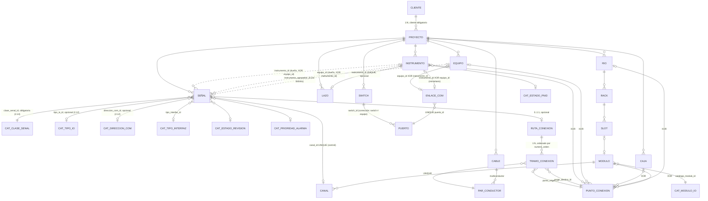

# Modelo lógico relacional del núcleo de SIEI (para SQL Server)

**Estado: CERRADO — versión final aprobada del núcleo, sincronizada con el modelo físico.** Incorpora las decisiones aprobadas por el usuario sobre las 5 decisiones de diseño originales, la corrección de modelado de SWITCH/PUERTO, la solución final de ruta/tramos de cableado, y las 4 confirmaciones finales (unicidad de TAG por proyecto, `CODIGO_PROYECTO` único por cliente, separación de dominios cableado/comunicaciones, y `CANALES_MAX` como regla de capacidad del modelo de módulo). **Actualización de sincronización**: `SEÑAL.puerto_id` fue retirado y reemplazado por la entidad `ENLACE_COM` (`EQUIPO`/`INSTRUMENTO` → `ENLACE_COM` → `PUERTO` → `SWITCH`), tal como se decidió durante el diseño del modelo físico (`MODELO_FISICO_SIEI.md`, sección 5) — este documento se actualiza para no contradecirlo, sin reabrir ninguna decisión ya aprobada. No quedan decisiones estructurales críticas pendientes en el modelo lógico — la siguiente etapa es completar el modelo físico y generar `001_initial_schema.sql`. Transforma el modelo conceptual en tablas, claves y relaciones — **sin** tipos de dato SQL Server específicos, sin `CREATE TABLE`, sin índices físicos, sin backend. Fuentes: `CLAUDE.md`, `ANALISIS_EXCEL_SIEI.md`, `MODELO_CONCEPTUAL_SIEI.md`, y las aclaraciones confirmadas durante la conversación.

**Leyenda**: 🔵 regla de negocio confirmada · 🟢 evidencia/práctica estándar no contradicha · 🟡 punto todavía sin confirmar explícitamente, señalado para tu atención · ✅ decisión aprobada por el usuario en esta ronda.

**Nota (migración 006)**: las entidades de Entregables (`ENTREGABLE`, `REVISION_ENTREGABLE`, `PLANTILLA_ENTREGABLE`, `CONFIGURACION_ORDEN`, `TIPO_ENTREGABLE`) **no pasaron por este documento** — nunca formaron parte del alcance del núcleo que este archivo cierra (ver `MODELO_CONCEPTUAL_SIEI.md`, "Documentos/Entregables/Revisiones" estaba explícitamente fuera de alcance). Se diseñaron directamente a nivel físico, con su propia ronda de diagnóstico y aprobación de negocio; el registro completo está en `MODELO_FISICO_SIEI.md` sección 8.20 y `CLAUDE.md`. Esto no reabre ni contradice nada de lo cerrado acá.

---

## 1. Principios transversales de diseño

Aplican a **todas** las tablas de este documento y no se repiten en cada entidad:

1. **PK interna siempre surrogate** — nunca el TAG, el `CODIGO_LAZO`, el `PnPID` ni ningún código visible. El tipo de dato concreto se decide en el modelo físico, no aquí.
2. **Todo campo con lista cerrada de valores se modela como catálogo `CAT_*`**, no como texto libre ni enumeración embebida. ✅ Confirmado en esta ronda: los catálogos `CAT_*` son **universales para todo SIEI**, no se duplican por proyecto ni por cliente (ver sección 2.7).
3. **Ninguna entidad guarda un atajo redundante hacia otra ya alcanzable por una relación existente** (regla ya confirmada para `caja_id`/`rio_id` en INSTRUMENTO, extendida a todo el modelo — ver Problema 4).
4. **Ninguna hoja de Excel se traduce literalmente a tabla** (`SENALES_CONTROL`/`SENALES_COM`/`MASTER_SENALES` colapsan en `SEÑAL`; `RESUMEN_*`, `LISTA_IO`, `LISTA_COM`, `DASHBOARD`, `COMPARATIVO_WSP` no tienen tabla).
5. ✅ **Consistencia de `proyecto_id` garantizada por FK compuesta, no solo por convención**: toda tabla que tiene `proyecto_id` define además una restricción `UNIQUE (id, proyecto_id)` (adicional a su PK simple `id`). Cada FK "hija" hacia esa tabla no se declara como `hijo.padre_id → padre.id`, sino como **FK compuesta** `(hijo.padre_id, hijo.proyecto_id) → padre.(id, proyecto_id)`. Con esto, SQL Server **rechaza nativamente** cualquier intento de enlazar una fila de un proyecto con una fila padre de otro proyecto — no depende de que una aplicación recuerde validarlo, ni de un trigger, para esta regla específica. Ver desarrollo completo en el Problema 5 (sección 2.5). Este principio **no** aplica a los catálogos `CAT_*` (no tienen `proyecto_id`, son globales por diseño).

---

## 2. Decisiones de diseño — resultado final aprobado

### 2.1 Problema 1 — Origen de una SEÑAL: INSTRUMENTO o EQUIPO ✅ Aprobado

**Alternativa A — dos FK nulas + `CHECK` de exclusión (XOR)**, tal como se propuso:

- `SEÑAL.instrumento_id` (nulo) y `SEÑAL.equipo_id` (nulo).
- `CHECK`: exactamente una de las dos debe estar poblada.
- Se descarta la FK polimórfica (Alternativa C) por perder integridad referencial nativa, y el supertipo/subtipo (Alternativa B) por complejidad no justificada hoy (solo hay dos orígenes confirmados).

Sin cambios respecto a la propuesta original; queda cerrado.

---

### 2.2 Problema 2 — Agrupación funcional (`TAG_INSTRUMENTO_ASOCIADO`) ✅ Aprobado

Se mantiene tal como se propuso: `SEÑAL.instrumento_agrupador_id → INSTRUMENTO.id` (nulo), **rol distinto** de `instrumento_id`/`equipo_id` (dueño directo). El TAG se muestra al usuario como atributo de `INSTRUMENTO`, pero la relación interna es siempre por FK/ID, nunca por texto — aplicando el mismo principio a lo largo de todo el modelo (confirmado explícitamente en el punto 8 de tu mensaje).

No existe `SEÑAL.lazo_id` directo — el lazo se obtiene vía `instrumento_agrupador_id → INSTRUMENTO → LAZO` (1:1). Sin cambios.

---

### 2.3 Problema 3 — Ruta física de una señal: CABLE / PAR_CONDUCTOR / tramos, con cantidad variable ✅ Resuelto (solución final, no una elección entre alternativas pendientes — instrucción tuya era que yo decidiera la solución técnica)

**Se descarta** el diseño anterior de una única tabla `CONEXIONADO` con `numero_tramo` limitado conceptualmente a 1 o 2, porque ese límite quedaba **codificado como restricción estructural** (`CHECK numero_tramo IN (1,2)`), justo lo que pediste evitar si no aporta beneficio real.

**Solución adoptada: cabecera + detalle ordenado**

- **`RUTA_CONEXION`** (cabecera): una fila por señal que tiene ruta física de cableado. Ancla el conjunto de tramos y da un lugar natural para futuros atributos de la ruta completa (no de un tramo individual) sin sobrecargar el primer tramo.
- **`TRAMO_CONEXION`** (detalle, N filas por ruta): cada fila es un segmento de la ruta, con `numero_orden` (1, 2, 3, … sin tope estructural), el `par_conductor_id` que ese segmento ocupa, y opcionalmente la `caja_id` en la que ese segmento termina/pasa antes de continuar al siguiente tramo (nulo en el último segmento, que llega directo al panel).

**Por qué esta solución y no la tabla plana con `numero_tramo` fijo:**

| | Tabla plana (`CONEXIONADO` + `numero_tramo` tope 2) | Cabecera + detalle (`RUTA_CONEXION` + `TRAMO_CONEXION`) |
|---|---|---|
| Cantidad de tramos | Requiere `CHECK` que codifica el máximo (rígido) | Sin tope estructural — 1, 2 o más filas de `TRAMO_CONEXION`, según lo que exista realmente |
| Atributos de la ruta completa (a futuro) | No hay dónde ponerlos sin forzarlos en el tramo 1 | `RUTA_CONEXION` es el lugar natural |
| Complejidad | Una tabla menos | Una tabla adicional, join extra para reconstruir la ruta completa |
| Reconstrucción del recorrido físico | Ordenar por `numero_tramo` (semántica mezclada: orden + "caso A/B") | Ordenar por `numero_orden` (semántica única: solo secuencia) |

El costo adicional (una tabla más, un JOIN más) es aceptable porque resuelve exactamente el problema que señalaste: no artificializar un máximo que no es un límite de negocio real, sino una observación del estado actual de los proyectos analizados.

**Reglas y su alcance:**

- `SEÑAL (0..1) ── (1) RUTA_CONEXION` — sigue siendo opcional (una señal COM no tiene ruta de cableado punto a punto en este sentido — usa `ENLACE_COM`/`PUERTO` en su lugar, ver 2.10/2.14).
- `RUTA_CONEXION (1) ── (N) TRAMO_CONEXION`, `UNIQUE (ruta_conexion_id, numero_orden)`.
- `TRAMO_CONEXION.par_conductor_id` **`UNIQUE`** — un conductor se usa en un único tramo a la vez (igual que antes).
- **Sin `canal_id` en `TRAMO_CONEXION`** — se mantiene la decisión ya aprobada del Problema 4: el destino final (canal) se obtiene únicamente vía `SEÑAL.canal_id`, nunca navegando por los tramos. (`TRAMO_CONEXION` tampoco tiene `caja_id` — ver 2.13, se deriva vía `PUNTO_CONEXION`.)
- 🟡 **Riesgo señalado, no resuelto por un `CHECK` simple** (ya lo era antes con 2 tramos, ahora generalizado a N): que `numero_orden` sea consecutivo sin huecos, y que si un tramo tiene `caja_id` poblado exista un tramo siguiente — sigue requiriendo trigger o validación de aplicación en el modelo físico. No cambia de naturaleza al quitar el tope de 2, solo se generaliza.
- El hecho observado hoy ("máximo 2 tramos, máximo 1 caja intermedia") **no se pierde como conocimiento** — sigue siendo válido como dato de negocio actual — pero deja de estar **forzado en la estructura**, tal como pediste.

`CABLE`, `PAR_CONDUCTOR` y su relación (`CABLE (1) ── (N) PAR_CONDUCTOR`, sin FK directa `CABLE ── SEÑAL`) se mantienen exactamente como en la propuesta original, ya aprobados en tu punto 2.

---

### 2.4 Problema 4 — SEÑAL↔CANAL y eliminación de rutas duplicadas ✅ Aprobado

- `SEÑAL.canal_id` (nulo) + `UNIQUE` — un canal físico admite máximo una señal activa. Se descarta, por ahora, la tabla histórica `ASIGNACION_CANAL` (diferida junto con el módulo de trazabilidad).
- **`TRAMO_CONEXION` (antes `CONEXIONADO`) no tiene `canal_id`** — confirmado explícitamente por ti: se evita mantener la misma relación en dos lugares. `SEÑAL.canal_id` es la única fuente de verdad. (Señales COM no usan `TRAMO_CONEXION` en absoluto — su medio es `ENLACE_COM`/`PUERTO`, sin FK de tipo "puerto" en ninguna parte de este dominio.)

---

### 2.5 Problema 5 — Aislamiento entre proyectos, sin excepciones, con integridad garantizada ✅ Aprobado (con precisión sobre el mecanismo)

Se retira la excepción que había señalado antes para `PAR_CONDUCTOR`/`CONEXIONADO` — **todas** las entidades de ingeniería de un proyecto llevan `proyecto_id` explícito, sin excepción: `INSTRUMENTO, EQUIPO, SEÑAL, RIO, RACK, SLOT, MÓDULO, CANAL, SWITCH, PUERTO, ENLACE_COM, CAJA, CABLE, PAR_CONDUCTOR, PUNTO_CONEXION, RUTA_CONEXION, TRAMO_CONEXION, LAZO`.

**Cómo se garantiza que las FK relacionadas pertenezcan siempre al mismo proyecto** (pediste explícitamente documentar esto, no solo declarar la columna):

1. Cada tabla con `proyecto_id` define, además de su PK `id`, una restricción `UNIQUE (id, proyecto_id)`.
2. Cada FK hacia esa tabla se declara como **FK compuesta**: por ejemplo, `CANAL` no referencia `MODULO(id)` con una FK simple sobre `modulo_id` — referencia `MODULO(id, proyecto_id)` con una FK compuesta `(modulo_id, proyecto_id)`, usando el propio `CANAL.proyecto_id` como segunda columna de la FK.
3. Con esto, **es estructuralmente imposible** insertar una fila de `CANAL` con `proyecto_id = 7` que apunte a un `MODULO` de `proyecto_id = 3` — el motor de SQL Server rechaza el `INSERT`/`UPDATE` directamente, sin necesidad de trigger para esta regla en particular.
4. Esto aplica a toda la cadena: `RACK→RIO`, `SLOT→RACK`, `MÓDULO→SLOT`, `CANAL→MÓDULO`, `PUERTO→SWITCH`, `TRAMO_CONEXION→RUTA_CONEXION`, `TRAMO_CONEXION→PAR_CONDUCTOR`, `TRAMO_CONEXION→PUNTO_CONEXION` (origen y destino, 2.13), `PUNTO_CONEXION→INSTRUMENTO/CAJA/RIO/MÓDULO` (XOR), `PAR_CONDUCTOR→CABLE`, `RUTA_CONEXION→SEÑAL`, `LAZO→INSTRUMENTO`, `SEÑAL→INSTRUMENTO/EQUIPO/CANAL`.
5. **No aplica** a las FK hacia catálogos `CAT_*` — esas son globales sin `proyecto_id`, así que su FK sigue siendo simple; el aislamiento entre proyectos no involucra a los catálogos por diseño (ver 2.7).
6. Esto resuelve el aislamiento de forma nativa y auditable, sin depender únicamente de que cada consulta recuerde filtrar por `proyecto_id` — que era precisamente el riesgo que señalaste (parte de la justificación por la que se descartó la Alternativa B original, "`proyecto_id` solo en tablas raíz").

Este mecanismo también es la base natural para implementar Row-Level Security más adelante en el modelo físico: cada tabla ya tiene su propia columna `proyecto_id` confiable, sin depender de JOINs.

---

### 2.6 Corrección — SWITCH no es EQUIPO ✅ Aplicado

Se corrige el modelo: en la versión anterior, `PUERTO` colgaba de `EQUIPO` bajo la hipótesis de que un switch de red era una instancia de `EQUIPO`. Queda corregido así:

- **`EQUIPO`** conserva su propósito original: activo de proceso/control que puede originar señales (incluidas señales COM que se originan en un equipo, ej. un PLC standalone). **No** tiene relación con puertos ni con infraestructura de red.
- **`SWITCH`** (tabla nueva): infraestructura de comunicaciones, independiente de `EQUIPO`, sin relación con `INSTRUMENTO` ni con `LAZO`. `PUERTO.switch_id → SWITCH.id` reemplaza al anterior `PUERTO.equipo_id → EQUIPO.id`.
- La cadena queda: `EQUIPO` (o `INSTRUMENTO`) origina una `SEÑAL` de tipo COM → esa señal puede vincularse a un `PUERTO` → el puerto pertenece a un `SWITCH`. El origen de la señal (Problema 1) y el medio físico por el que viaja (`SWITCH`/`PUERTO`) quedan **desacoplados**, tal como pediste.
- Modelado deliberadamente mínimo: sin VLAN, sin enlaces entre switches, sin topología — se diseñará si el negocio lo requiere explícitamente más adelante.

---

### 2.7 Catálogos `CAT_*` — universales, confirmados ✅ Aprobado

```
SIEI
 ├── CATÁLOGOS UNIVERSALES (CAT_TIPO_IO, CAT_TIPO_INTERFAZ, CAT_ESTADO_REVISION,
 │                           CAT_PRIORIDAD_ALARMA, CAT_ESTADO_PNID, CAT_MODULO_IO)
 └── CLIENTE
       └── PROYECTO
             └── datos de ingeniería propios del proyecto
```

Los `CAT_*` **no** tienen `proyecto_id` ni `cliente_id` — son compartidos por todo SIEI. Si en el futuro algún catálogo necesita valores específicos por cliente/proyecto, se extenderá explícitamente cuando surja el caso real (no se anticipa). Esto cierra la pregunta 🟡 que había quedado abierta en la versión anterior para `CAT_TIPO_IO`, `CAT_TIPO_INTERFAZ` y `CAT_MODULO_IO`.

No se convierte automáticamente todo texto en catálogo — solo los dominios cerrados ya evidenciados en el Excel (listas de validación de datos) o confirmados como regla de negocio.

---

### 2.8 Unicidad de TAG dentro del proyecto ✅ Aprobado

Confirmado como regla de negocio, no global: `TAG_INSTRUMENTO`, `TAG_SENAL` y `TAG_EQUIPO` son únicos **dentro de cada proyecto**, no en toda SIEI. El mismo texto de TAG puede repetirse en proyectos distintos sin ser inconsistencia — son contextos de ingeniería diferentes.

- `UNIQUE (proyecto_id, tag_instrumento)` en `INSTRUMENTO` — ya estaba, queda confirmado sin reserva.
- `UNIQUE (proyecto_id, tag_senal)` en `SEÑAL` — antes 🟡, ahora 🔵 confirmado.
- `UNIQUE (proyecto_id, tag_equipo)` en `EQUIPO` — antes 🟡, ahora 🔵 confirmado.

El TAG sigue siendo un identificador de negocio, nunca la PK interna (principio 1, sin cambios).

---

### 2.9 CODIGO_PROYECTO — único por cliente, no global ✅ Aprobado

`PROYECTO.codigo_proyecto` es único **dentro de cada cliente**, no globalmente en SIEI: `UNIQUE (cliente_id, codigo_proyecto)`. Dos clientes distintos pueden tener cada uno un proyecto con el mismo código (ej. "620") sin conflicto — son registros distintos identificados internamente por `PROYECTO.id`. Cierra la pregunta 🟡 que había quedado abierta.

---

### 2.10 Dominios separados: señales cableadas vs. señales comunicadas ✅ Aprobado

Confirmado explícitamente: `PAR_CONDUCTOR` / `RUTA_CONEXION` / `TRAMO_CONEXION` **no aplican** a señales comunicadas. Son dos dominios de conexionado físico distintos, sin mezclarse:

```
Señal cableada:      SEÑAL ── RUTA_CONEXION ── TRAMO_CONEXION ── PAR_CONDUCTOR ── CABLE
                                    (cada tramo entre dos PUNTO_CONEXION: instrumento/caja/rio/módulo — 2.13)
                                    SEÑAL ── CANAL (destino final)

Señal comunicada:    EQUIPO / INSTRUMENTO ── ENLACE_COM ── PUERTO ── SWITCH
                                    (el enlace es del EQUIPO/INSTRUMENTO, no de cada SEÑAL)
                      SEÑAL (COM) ── EQUIPO / INSTRUMENTO (mismo dueño del Problema 1)
```

**Actualización de sincronización (ver `MODELO_FISICO_SIEI.md` sección 5)**: `SEÑAL` ya **no** tiene columna `puerto_id`. El puerto/switch de una señal comunicada se obtiene navegando `SEÑAL.instrumento_id`/`equipo_id → ENLACE_COM → PUERTO → SWITCH` — el enlace físico de comunicaciones pertenece al equipo/instrumento (su dueño), no a cada señal individual, evitando repetir el mismo `puerto_id` en todas las señales COM de un mismo equipo. Ver entidad `ENLACE_COM` en la sección 3.15b.

Una señal cableada usa `SEÑAL.canal_id` y, si tiene ruta física modelada, una fila en `RUTA_CONEXION`; una señal comunicada no tiene `RUTA_CONEXION` (ese dominio es exclusivo de instrumentación) ni `canal_id`. 🟡 **Nota de alcance**: esta separación no está forzada hoy por un `CHECK`/trigger que impida crear una `RUTA_CONEXION` para una señal cuyo `tipo_interfaz_id` sea "COMUNICADA" — queda documentada como regla de negocio a validar en la aplicación (sin cambios respecto a la decisión original).

No se diseña topología de comunicaciones más allá de `SWITCH → PUERTO` (ya cubierto en 2.6).

---

### 2.11 CANALES_MAX — capacidad del modelo de módulo, con protección en dos niveles ✅ Aprobado

Confirmado: `CANALES_MAX` es un atributo del **modelo/configuración del módulo** (`CAT_MODULO_IO.canales_max`), no una regla fija universal por tipo de I/O. Cuando un módulo (`MÓDULO`) se instala en un `SLOT`, SIEI debe generar automáticamente sus `CANAL` válidos (`CH00`…`CH0{canales_max-1}`) — el usuario no los crea manualmente uno por uno.

**Protección en dos niveles, ambas requeridas:**

1. **Aplicación/backend**: valida la capacidad del modelo antes de crear, modificar o reasignar canales — primera línea de defensa, con mejores mensajes de error y evita llegar a la base con datos inválidos en el flujo normal.
2. **Base de datos**: dado que un `CHECK` de columna no puede consultar otra tabla (`CANAL` no puede validar por sí sola cuántos canales admite el `CAT_MODULO_IO` de su módulo con un `CHECK` simple), la garantía a nivel de motor se resuelve en el **modelo físico** mediante un **trigger** (`AFTER INSERT/UPDATE` sobre `CANAL`, o sobre `MÓDULO` al vincular `catalogo_modulo_id`) que cuenta los canales existentes del módulo contra `CAT_MODULO_IO.canales_max` y rechaza la operación si se excede. Se documenta la definición completa del trigger en `docs/MODELO_FISICO_SIEI.md` — aquí queda fijado el **requisito**, no la implementación SQL.

La regla ya confirmada **"un canal físico → máximo una señal activa"** (`SEÑAL.canal_id` `UNIQUE`, Problema 4) se mantiene sin cambios y se implementa con `UNIQUE`, no con trigger — no requiere el mismo mecanismo porque no necesita consultar una tabla externa.

---

### 2.12 CAT_TIPO_IO vs. dirección de comunicaciones — separados ✅ Aprobado

Confirmado tras la auditoría de cobertura de datos: `AI/AO/DI/DO/RTD` (tipo físico de hardware de E/S) e `IN/OUT` de comunicaciones (dirección de un dato en la red) **no son el mismo concepto de negocio** — la evidencia del Excel mostró incluso casos donde el propio archivo, al forzar ambos en una sola columna, clasificó por error una señal comunicada como `AI`.

- `CAT_TIPO_IO` queda restringido a clasificación física (`AI, AO, DI, DO, RTD`, y otros tipos físicos que se confirmen — nunca `IN`/`OUT`).
- Nuevo catálogo universal `CAT_DIRECCION_COM` (`IN`, `OUT`) exclusivo de señales comunicadas.
- `SEÑAL.tipo_io_id` deja de ser `NOT NULL` (una señal COM no tiene por qué pertenecer a AI/AO/DI/DO); se agrega `SEÑAL.direccion_com_id` nula, FK a `CAT_DIRECCION_COM`.
- Protección de la exclusión entre dominios: **no hace falta trigger** — como ambas columnas están en la misma fila de `SEÑAL`, un `CHECK` simple basta (`no ambas pobladas a la vez`), igual que el patrón ya usado para el origen de la señal (Problema 1). Se documenta como requisito; la sintaxis exacta del `CHECK` se deja para el modelo físico.

---

### 2.13 Terminaciones — nueva entidad PUNTO_CONEXION ✅ Aprobado (Alternativa B)

Se incorpora `PUNTO_CONEXION`, que representa un **extremo físico real** de una conexión (una regleta/bornera/borne concreto en un instrumento, una caja, un gabinete RIO o un módulo de I/O) — resuelve la brecha de terminaciones detectada en `MATRIZ_COBERTURA_DATOS_SIEI.md` sin caer en texto suelto ni en una FK polimórfica sin integridad.

**Pertenencia de un punto — FK nulas + `CHECK` XOR** (mismo patrón ya usado dos veces: origen de `SEÑAL`, origen de `ENLACE_COM`):

`PUNTO_CONEXION.instrumento_id` / `equipo_id` / `caja_id` / `rio_id` / `modulo_id` — nulos, exactamente uno poblado. 🔵 **`RIO` y `MÓDULO` se mantienen como dos pertenencias independientes, no una subordinada a la otra** — la evidencia del Excel muestra borneras/regletas propias del gabinete RIO (`TB DE RIO`/`BORNERA DE RIO`) distintas de las del módulo de I/O (`TERMINAL DE MÓDULO`); forzar todo punto de un RIO a depender de un `MÓDULO` habría perdido esa distinción real.

✅ **Corrección de esta ronda**: `EQUIPO` se agrega como quinto rol de pertenencia. El modelo conceptual ya confirmaba que "una señal originada en un EQUIPO participa igual del conexionado físico (cable/caja/canal) que una originada en un INSTRUMENTO" (`MODELO_CONCEPTUAL_SIEI.md` 2.4) — excluir `EQUIPO` del XOR de `PUNTO_CONEXION` contradecía esa regla ya confirmada para cualquier señal `CONTROL` cuyo dueño directo fuera un equipo (ej. un contacto seco de un relé cableado a una tarjeta DI). No es una extensión especulativa: es una corrección de una contradicción real detectada entre entidades ya aprobadas.

**`TRAMO_CONEXION` se redefine** para usar dos puntos en vez de un solo `caja_id`:

```
Instrumento/Equipo → PUNTO_CONEXION (instrumento/equipo) → Cable/Par → PUNTO_CONEXION (caja)
Caja                → PUNTO_CONEXION (caja)               → Cable/Par → PUNTO_CONEXION (RIO o MÓDULO)
```

- `TRAMO_CONEXION.punto_origen_id` y `punto_destino_id` → `PUNTO_CONEXION`, ambos `NOT NULL`.
- **`TRAMO_CONEXION.caja_id` se elimina** — aplicando el principio "no duplicar una relación si puede derivarse de una ruta relacional única y confiable": si el tramo pasa por una caja, eso ya se sabe porque `punto_destino_id` (o `punto_origen_id` del tramo siguiente) es un `PUNTO_CONEXION` cuyo `caja_id` está poblado. Mantener además `tramo_conexion.caja_id` habría sido guardar el mismo hecho dos veces.
- Se espera (regla de consistencia, documentada para el trigger del físico) que el `punto_destino_id` de un tramo coincida con el `punto_origen_id` del tramo siguiente de la misma ruta — el punto es el nodo compartido donde un tramo entrega al siguiente. 🔵 **Validado contra evidencia real** (`02_MASTER_IO_620.xlsm`, columnas `BORNERA_BLOQUE_CAJA`/`BORNE_JB` por señal): dentro de una misma caja, cada señal ocupa **un único** bloque de bornas donde empalman el tramo de campo y el tramo de panel — no dos bloques distintos. Una sola fila `PUNTO_CONEXION` por señal en la caja es correcta y suficiente; no se cambia la regla.
- **Corrección de esta ronda**: el primer tramo de la ruta ya no solo debe "pertenecer a `INSTRUMENTO`" — debe coincidir **exactamente con el dueño real de la señal**: si `senal.instrumento_id` está poblado, `punto_origen.instrumento_id` debe ser ese mismo instrumento; si `senal.equipo_id` está poblado, `punto_origen.equipo_id` debe ser ese mismo equipo. No basta con que el punto pertenezca a "algún" instrumento o equipo — debe ser el dueño real de esa señal específica. Aplica solo a señales `CONTROL` con ruta física; no cambia nada del dominio COM.

No se convierten `regleta`/`bornera`/`borne`/`lado`/`circuito`/`hilo` en catálogos todavía — son atributos de texto/identificador en `PUNTO_CONEXION`, no dominios cerrados confirmados.

---

### 2.14 CLASE_SEÑAL — clasificación explícita CONTROL/COM ✅ Aprobado

Hasta ahora, si una señal era `CONTROL` o `COM` solo se podía **inferir** combinando `tipo_io_id`, `direccion_com_id`, `canal_id` y `tipo_interfaz_id`. Se agrega una clasificación explícita y obligatoria:

- Nuevo catálogo universal `CAT_CLASE_SENAL` (`CONTROL`, `COM`), mismo tratamiento que el resto de `CAT_*` — sin `proyecto_id` (2.7).
- `SEÑAL.clase_senal_id` — FK **`NOT NULL`** hacia `CAT_CLASE_SENAL`. A diferencia de `tipo_io_id`/`direccion_com_id`/`canal_id` (todos opcionales, porque una señal puede existir antes de completar su asignación física), `clase_senal_id` es obligatoria desde la creación — clasificar el dominio de una señal no depende de si ya tiene canal, puerto o ruta asignados.

**Distinción explícita entre los cuatro conceptos, para no volver a mezclarlos**:

| Concepto | Pregunta que responde | Aplica a |
|---|---|---|
| `CLASE_SEÑAL` | ¿A qué dominio pertenece la señal? | Toda señal, obligatorio |
| `TIPO_IO` | ¿Qué clasificación física de I/O utiliza? | Solo señales `CONTROL`, opcional (hasta que se asigne) |
| `TIPO_INTERFAZ` | ¿Qué característica/interfaz tiene? | Cualquier señal (concepto independiente, no sustituto de `CLASE_SEÑAL`) |
| `DIRECCION_COM` | ¿En qué dirección se intercambia el dato comunicado? | Solo señales `COM`, opcional |

**Regla de negocio confirmada, separando clasificación de asignación física**: `clase_senal_id` se fija en cuanto la señal existe (es su dominio, no cambia); `tipo_io_id`/`canal_id` (CONTROL) o `direccion_com_id`/`ENLACE_COM`-`PUERTO` (COM) pueden quedar nulos/pendientes mientras la asignación física todavía no ocurre — una señal `CONTROL` sin canal asignado, o una señal `COM` sin infraestructura de comunicaciones completa, siguen siendo válidas.

**Protección de consistencia** — dos mecanismos, según lo que cada regla necesita consultar:
- Reglas que **no** dependen de qué código tiene la clase (solo de las propias columnas de `SEÑAL`): siguen protegidas por `CHECK` de una sola fila (ej. no ambas `tipo_io_id`/`direccion_com_id` pobladas a la vez).
- Reglas que **sí** dependen del código de `clase_senal_id` (ej. "si `CLASE = COM`, `canal_id` debe ser `NULL`"): un `CHECK` de SQL Server **no puede** consultar otra tabla para leer el código del catálogo — se documenta como trigger en el modelo físico, no como `CHECK`. Detalle completo en `MODELO_FISICO_SIEI.md`.

Ningún cambio a las decisiones ya aprobadas sobre origen de señal, `instrumento_agrupador_id`, asignación a `CANAL`, `ENLACE_COM`, `SWITCH`/`PUERTO`, `RUTA_CONEXION`/`TRAMO_CONEXION`, `PUNTO_CONEXION`, `CABLE`/`PAR_CONDUCTOR`, `LAZO` o aislamiento multiproyecto — `CLASE_SEÑAL` es una clasificación adicional, no una restructuración.

---

### 2.15 Coherencia entre el destino físico de la ruta y el CANAL asignado ✅ Aprobado

Detectada una posible inconsistencia: `SEÑAL.canal_id` determina un RIO/módulo (vía `CANAL → MÓDULO → SLOT → RACK → RIO`), y por separado el último `TRAMO_CONEXION` de la ruta termina en un `PUNTO_CONEXION` perteneciente a `RIO` o `MÓDULO` — nada obligaba hasta ahora a que ambos caminos apuntaran al **mismo** RIO/módulo, permitiendo una señal con canal asignado en un RIO pero ruta física terminando en otro.

**Regla añadida**: cuando `senal.canal_id` **no** es nulo y existe una `ruta_conexion` **activa**:
- si el último `PUNTO_CONEXION` (mayor `numero_orden`, tramo activo) pertenece a `MÓDULO`, ese `modulo_id` debe ser el mismo módulo al que pertenece `senal.canal_id`;
- si pertenece a `RIO`, ese `rio_id` debe ser el mismo RIO alcanzado desde `senal.canal_id → módulo → slot → rack → rio`.

**No** se exige esta coherencia si `canal_id` es nulo (la señal `CONTROL` puede existir sin canal asignado todavía) o si no hay ninguna ruta activa — la validación solo aplica cuando ambos lados del hecho existen simultáneamente.

Igual que en 2.14, esta regla depende del contenido de otra tabla (`canal`/`modulo`/`rack`/`rio`) para resolverse, así que **no es expresable en `CHECK`** — se protege con trigger, documentado en `MODELO_FISICO_SIEI.md`. Por mantenibilidad y claridad de mensajes de error, se mantiene como una regla **separada** de `TR_tramo_conexion_validar_secuencia` (que valida solo continuidad interna de la ruta, sin tocar `SEÑAL`/`CANAL`) — ver justificación completa en el físico.

---

## 3. Catálogo de entidades (tablas)

Todas las tablas con `proyecto_id` siguen el patrón de FK compuesta descrito en el principio 5 / sección 2.5 — no se repite en cada entidad. Los catálogos `CAT_*` no tienen `proyecto_id` (sección 2.7).

### 3.1 CLIENTE

| | |
|---|---|
| **Propósito** | Organización contratante, dueña de uno o más proyectos. |
| **PK interna** | `id`. |
| **FK** | Ninguna. |
| **Atributos principales** | `nombre`, `codigo_interno` *(atributos definitivos diferidos al módulo Cliente/Proyecto)*. |
| **Obligatorios** | `nombre`. |
| **Relaciones** | `CLIENTE (1) ── (N) PROYECTO` 🔵, obligatoria del lado PROYECTO. |
| **Alcance por proyecto** | No aplica — CLIENTE es superior a PROYECTO. |

### 3.2 PROYECTO

| | |
|---|---|
| **Propósito** | Contexto raíz que aísla los datos de ingeniería de un trabajo específico. |
| **PK interna** | `id`. Define `UNIQUE (id, cliente_id)` no es necesario (PROYECTO es la raíz del aislamiento); en cambio, **todas** las tablas hijas usan `(id, proyecto_id)` como se describe en 2.5. |
| **FK** | `cliente_id` → CLIENTE (**NOT NULL**, 🔵 todo proyecto requiere cliente). |
| **Atributos principales** | `codigo_proyecto`, `nombre`. *(Etapas, alcance contractual, disciplinas: diferidos.)* |
| **Obligatorios** | `cliente_id`, `codigo_proyecto`, `nombre`. |
| **UNIQUE** | `(cliente_id, codigo_proyecto)` 🔵 — único por cliente, no global (2.9). |
| **Relaciones** | Raíz de todas las entidades del núcleo. |
| **Alcance por proyecto** | Es el propio ancla de alcance. |

### 3.3 INSTRUMENTO

| | |
|---|---|
| **Propósito** | Dispositivo de campo con identidad de ingeniería propia; puede originar señales y anclar un lazo. |
| **PK interna** | `id`. `UNIQUE (id, proyecto_id)`. |
| **FK** | `proyecto_id` → PROYECTO (NOT NULL); `estado_pnid_id` → `CAT_ESTADO_PNID` (nulo); `instrumento_asociado_id` → INSTRUMENTO, auto-referencia (nulo, migración 005). |
| **Atributos principales** | `tag_instrumento`, `pnpid`, `fuente_pnpid`, `descripcion`, `tipo_instrumento` (texto, 🟡 candidato a catálogo futuro), `servicio`, `sistema`, `ubicacion`, `nodo`, `fecha_agregado`, `fecha_ultima_revision`. **Agregados en migración 004** (importación P&ID/Plant 3D, ver `MODELO_FISICO_SIEI.md` 8.3 y `CLAUDE.md`): `tag_anterior`, `tecnologia`, `funcionamiento`, `cuerpo_instrumento`, `conexion_proceso`, `plano_pnid`, `linea_pnid`, `tipo_senal_pnid`, `equipo_asociado_id` (FK opcional → EQUIPO, relación distinta de `SEÑAL.equipo_id`), `equipo_asociado_tag`. **Agregados en migración 005** (columna "Instrumento Asociado" del reporte P&ID, ver `MODELO_FISICO_SIEI.md` 8.3): `instrumento_asociado_id` (FK opcional, auto-referencia a INSTRUMENTO — "el instrumento contiene al otro instrumento asociado", nunca a sí mismo), `instrumento_asociado_tag`, modelados y sincronizados igual que `equipo_asociado_id`/`_tag`. |
| **Obligatorios** | `proyecto_id`, `tag_instrumento`. |
| **UNIQUE** | `(proyecto_id, tag_instrumento)` 🔵. `(proyecto_id, pnpid)` cuando no nulo 🟡. |
| **Nota (migración 004)** | `pnpid`/`fuente_pnpid` dejaron de ser editables por el backend vía `POST`/`PATCH` de instrumentos — solo los administra el importador P&ID (`integracion.importacion_pnid*`, ver `MODELO_FISICO_SIEI.md` 8.3.1). |
| **Relaciones** | `PROYECTO (N)──(1)`; `SEÑAL (0..N)──(1)` dueño directo; `SEÑAL (0..N)──(1)` agrupador funcional (rol distinto); `LAZO (0..1)──(1)` opcional 🔵. |
| **Integridad** | `tag_instrumento` no es PK; ninguna FK directa hacia CAJA/CABLE/RIO/CANAL/SWITCH 🔵. |
| **Alcance por proyecto** | Directo. |

### 3.4 EQUIPO

| | |
|---|---|
| **Propósito** | Activo de proceso/control (variador, relé, UPS, PLC standalone) que puede originar señales, sin ser instrumento de campo. 🔵 **No incluye infraestructura de comunicaciones** — ver corrección 2.6: un switch no es un EQUIPO. |
| **PK interna** | `id`. `UNIQUE (id, proyecto_id)`. |
| **FK** | `proyecto_id` → PROYECTO (NOT NULL). |
| **Atributos principales** | `tag_equipo`, `descripcion`, `sistema`, `nodo`, `panel`. |
| **Obligatorios** | `proyecto_id`, `tag_equipo`. |
| **UNIQUE** | `(proyecto_id, tag_equipo)` 🔵 (2.8). |
| **Relaciones** | `PROYECTO (N)──(1)`; `SEÑAL (0..N)──(1)` dueño directo; `ENLACE_COM (0..1)──(1)`, rol "dueño del enlace de comunicaciones" (sincronizado con el físico, sección 3.15b) — mismo patrón XOR que en SEÑAL, un enlace es de un EQUIPO o de un INSTRUMENTO, nunca ambos. **Sin** relación con INSTRUMENTO ni LAZO 🔵; sin relación directa con SWITCH/PUERTO (se llega vía ENLACE_COM). |
| **Alcance por proyecto** | Directo. |

### 3.5 SEÑAL

| | |
|---|---|
| **Propósito** | Unidad atómica de información de I&C; se origina en un instrumento o en un equipo, tiene clasificación de tipo, y puede tener una ruta de conexionado (si es cableada) o un puerto asignado a través del enlace de su dueño (si es comunicada). |
| **PK interna** | `id`. `UNIQUE (id, proyecto_id)`. |
| **FK** | `proyecto_id` → PROYECTO (NOT NULL); `instrumento_id` → INSTRUMENTO (nulo, rol "dueño directo"); `equipo_id` → EQUIPO (nulo, rol "dueño directo"); `instrumento_agrupador_id` → INSTRUMENTO (nulo, rol "agrupador/lazo"); `clase_senal_id` → `CAT_CLASE_SENAL` (**NOT NULL**, nueva — ver 2.14); `tipo_io_id` → `CAT_TIPO_IO` (nulo — ver 2.12); `direccion_com_id` → `CAT_DIRECCION_COM` (nulo — ver 2.12); `tipo_interfaz_id` → `CAT_TIPO_INTERFAZ` (nulo); `canal_id` → CANAL (nulo); `estado_revision_id` → `CAT_ESTADO_REVISION` (nulo); `prioridad_alarma_id` → `CAT_PRIORIDAD_ALARMA` (nulo). ~~`puerto_id`~~ **retirada** — sincronizado con el físico (sección 3.15b): el puerto de una señal COM se obtiene navegando `instrumento_id`/`equipo_id → ENLACE_COM → PUERTO`, no por FK directa. |
| **Atributos principales** | `tag_senal`, `nombre_corto`, `descripcion`, `rango_min`, `rango_max`, `alarma_hh/h/l/ll`, `valor_normal`, `unidad_ingenieria`, `retardo`, `enclavamiento`, `observacion`. |
| **Obligatorios** | `proyecto_id`, `clase_senal_id` (2.14), exactamente uno de (`instrumento_id`, `equipo_id`) — Problema 1. `tipo_io_id`/`direccion_com_id`/`canal_id` **no** son obligatorios — clasificación (`clase_senal_id`) y asignación física son conceptos distintos (2.14). |
| **UNIQUE** | `(proyecto_id, tag_senal)` 🔵 (2.8). `canal_id` cuando no nulo — Problema 4. |
| **Relaciones** | Ver FKs. Además: `RUTA_CONEXION (0..1)──(1)`, aplicable únicamente a señales `CONTROL` (2.14). |
| **Integridad** | `CHECK`: exactamente una de (`instrumento_id`, `equipo_id`) no nula. `CHECK`: no ambas (`tipo_io_id`, `direccion_com_id`) pobladas a la vez — restricción catálogo-agnóstica de referencia. Reglas más precisas, atadas al código de `clase_senal_id` (ej. "si COM, `canal_id` debe ser nulo"), **no son expresables en `CHECK`** por requerir leer el catálogo — se protegen con trigger, ver `MODELO_FISICO_SIEI.md`. |
| **Alcance por proyecto** | Directo. |

### 3.6 CAT_TIPO_IO (catálogo universal)

| | |
|---|---|
| **Propósito** | 🔵 **Corregido (2.12)** — clasificación **física** de hardware de E/S de señales cableadas: `DI, DO, AI, AO, RTD`, y otros tipos físicos que se confirmen. **Ya no incluye `IN`/`OUT`** de comunicaciones. |
| **PK interna** | `id`. |
| **Atributos** | `codigo`, `descripcion`. |
| **UNIQUE** | `codigo`. |
| **Relaciones** | `SEÑAL (N)──(0..1)` — opcional, solo señales cableadas. |
| **Alcance** | ✅ Universal, sin `proyecto_id` (2.7). |

### 3.6b CAT_DIRECCION_COM (catálogo universal, nuevo)

| | |
|---|---|
| **Propósito** | Dirección de la información en una señal comunicada: `IN`, `OUT`. Concepto distinto del tipo físico de I/O (2.12) — evidencia del Excel mostró que mezclarlos produce inconsistencias (señales COM ocasionalmente mal clasificadas como `AI`). |
| **PK interna** | `id`. |
| **Atributos** | `codigo`, `descripcion`. |
| **UNIQUE** | `codigo`. |
| **Relaciones** | `SEÑAL (N)──(0..1)` — opcional, solo señales comunicadas. |
| **Alcance** | ✅ Universal, sin `proyecto_id`. |

### 3.6c CAT_CLASE_SENAL (catálogo universal, nuevo — 2.14)

| | |
|---|---|
| **Propósito** | Clasificación explícita del dominio de una señal: `CONTROL` (cableada/hardwired) o `COM` (comunicada). Evita inferir el dominio a partir de `tipo_io_id`/`direccion_com_id`/`canal_id`/`tipo_interfaz_id`. |
| **PK interna** | `id`. |
| **Atributos** | `codigo` (`CONTROL`, `COM`), `descripcion`. |
| **UNIQUE** | `codigo`. |
| **Relaciones** | `SEÑAL (N)──(1)` — **obligatoria**, a diferencia del resto de catálogos de clasificación de señal. |
| **Alcance** | ✅ Universal, sin `proyecto_id`. |

### 3.7 CAT_TIPO_INTERFAZ (catálogo universal)

| | |
|---|---|
| **Propósito** | `4-20 mA`, `4-20 mA + HART`, `120 VAC`, `COMUNICADA`, etc. |
| **PK interna** | `id`. |
| **Atributos** | `codigo`, `descripcion`. |
| **UNIQUE** | `codigo`. |
| **Relaciones** | `SEÑAL (N)──(1)`, opcional. |
| **Alcance** | ✅ Universal, sin `proyecto_id`. |

### 3.8 RIO

| | |
|---|---|
| **Propósito** | Gabinete/panel de entrada-salida remota. |
| **PK interna** | `id`. `UNIQUE (id, proyecto_id)`. |
| **FK** | `proyecto_id` → PROYECTO (NOT NULL). |
| **Atributos** | `tag_rio`, `descripcion`. |
| **UNIQUE** | `(proyecto_id, tag_rio)`. |
| **Relaciones** | `PROYECTO (N)──(1)`; `RACK (0..N)──(1)`. |
| **Alcance por proyecto** | Directo. |

### 3.9 RACK

| | |
|---|---|
| **Propósito** | Bastidor/chasis dentro de un RIO. |
| **PK interna** | `id`. `UNIQUE (id, proyecto_id)`. |
| **FK** | `proyecto_id` → PROYECTO (NOT NULL); `(rio_id, proyecto_id)` → `RIO (id, proyecto_id)` — FK compuesta (2.5). |
| **Atributos** | `numero_rack`. |
| **UNIQUE** | `(rio_id, numero_rack)`. |
| **Relaciones** | `RIO (N)──(1)`; `SLOT (0..N)──(1)`. |
| **Alcance por proyecto** | Directo + garantizado vía FK compuesta a RIO. |

### 3.10 SLOT

| | |
|---|---|
| **Propósito** | Posición física dentro de un rack donde se instala un módulo. |
| **PK interna** | `id`. `UNIQUE (id, proyecto_id)`. |
| **FK** | `proyecto_id` → PROYECTO (NOT NULL); `(rack_id, proyecto_id)` → `RACK (id, proyecto_id)`. |
| **Atributos** | `numero_slot`. |
| **UNIQUE** | `(rack_id, numero_slot)`. |
| **Relaciones** | `RACK (N)──(1)`; `MÓDULO (0..1)──(1)`. |
| **Alcance por proyecto** | Directo + FK compuesta. |

### 3.11 CAT_MODULO_IO (catálogo universal de hardware)

| | |
|---|---|
| **Propósito** | Catálogo de modelos de módulo de I/O (fabricante/referencia) y su capacidad — evita hardcodear 16/8 canales como constantes. |
| **PK interna** | `id`. |
| **Atributos** | `fabricante`, `modelo`, `tipo_io_id` → `CAT_TIPO_IO`, `canales_max`. |
| **UNIQUE** | `(fabricante, modelo)`. |
| **Relaciones** | `MÓDULO (N)──(1)`. |
| **Alcance** | ✅ Universal — es dato de fabricante de hardware, no de ingeniería de un proyecto particular; queda dentro del mismo grupo que los demás `CAT_*` (2.7). |

### 3.12 MÓDULO

| | |
|---|---|
| **Propósito** | Tarjeta física de I/O instalada en un slot. |
| **PK interna** | `id`. `UNIQUE (id, proyecto_id)`. |
| **FK** | `proyecto_id` → PROYECTO (NOT NULL); `(slot_id, proyecto_id)` → `SLOT (id, proyecto_id)`; `catalogo_modulo_id` → `CAT_MODULO_IO` (NOT NULL, FK simple — catálogo universal). |
| **UNIQUE** | `slot_id` (1 módulo por slot). |
| **Relaciones** | `SLOT (1)──(1)`; `CANAL (1)──(N)`, generados automáticamente al vincular `catalogo_modulo_id` (🔵 confirmado, 2.11) y limitados a `catalogo_modulo_id.canales_max` — protección en dos niveles (aplicación + trigger en el modelo físico, ver 2.11). |
| **Alcance por proyecto** | Directo + FK compuesta. |

### 3.13 CANAL

| | |
|---|---|
| **Propósito** | Punto físico de I/O dentro de un módulo; destino final de una señal de control. |
| **PK interna** | `id`. `UNIQUE (id, proyecto_id)`. |
| **FK** | `proyecto_id` → PROYECTO (NOT NULL); `(modulo_id, proyecto_id)` → `MÓDULO (id, proyecto_id)`. |
| **Atributos** | `numero_canal`. |
| **UNIQUE** | `(modulo_id, numero_canal)`. |
| **Relaciones** | `MÓDULO (N)──(1)`; `SEÑAL (0..1)──(1)` — ocupación determinada únicamente por la existencia de una fila en `SEÑAL` con `canal_id` hacia él; sin atributo `ocupado` redundante. |
| **Alcance por proyecto** | Directo + FK compuesta. |

### 3.14 SWITCH *(nueva — corrección 2.6)*

| | |
|---|---|
| **Propósito** | Infraestructura de comunicaciones (ej. switch de red) que expone puertos usados por señales comunicadas. 🔵 Conceptualmente separado de `EQUIPO` — no es un activo de proceso/control ni un subtipo de EQUIPO. |
| **PK interna** | `id`. `UNIQUE (id, proyecto_id)`. |
| **FK** | `proyecto_id` → PROYECTO (NOT NULL). |
| **Atributos principales** | `tag_switch`, `descripcion`, `marca_modelo` (opcional). |
| **Obligatorios** | `proyecto_id`, `tag_switch`. |
| **UNIQUE** | `(proyecto_id, tag_switch)`. |
| **Relaciones** | `PROYECTO (N)──(1)`; `PUERTO (1)──(N)`. **Sin** relación con `EQUIPO`, `INSTRUMENTO` ni `LAZO`. |
| **Alcance por proyecto** | Directo. |
| **Nota de alcance** | Modelado mínimo para representar SWITCH→PUERTO→SEÑAL COM; sin topología de red (VLAN, enlaces entre switches) — diferido hasta que se requiera explícitamente. |

### 3.15 PUERTO

| | |
|---|---|
| **Propósito** | Punto de conexión de red — equivalente de `CANAL` para señales de comunicaciones, con la diferencia de que puede concentrar varias señales del mismo equipo/instrumento a través de un único enlace. |
| **PK interna** | `id`. `UNIQUE (id, proyecto_id)`. |
| **FK** | `proyecto_id` → PROYECTO (NOT NULL); `(switch_id, proyecto_id)` → `SWITCH (id, proyecto_id)` — **antes `equipo_id`, corregido en 2.6**. |
| **Atributos** | `numero_puerto`. |
| **UNIQUE** | `(switch_id, numero_puerto)`. |
| **Relaciones** | `SWITCH (N)──(1)`; `ENLACE_COM (0..1)──(1)` — 🔵 **actualizado (sincronización con el físico)**: ya no se relaciona directamente con `SEÑAL` — un puerto se asigna a lo sumo a un `ENLACE_COM` activo (el enlace de un equipo/instrumento), y todas las señales de ese equipo/instrumento comparten el puerto navegando `SEÑAL → EQUIPO/INSTRUMENTO → ENLACE_COM → PUERTO`, sin FK repetida por señal. |
| **Alcance por proyecto** | Directo + FK compuesta. |

### 3.15b ENLACE_COM *(nueva — sincronizada con `MODELO_FISICO_SIEI.md` sección 5)*

| | |
|---|---|
| **Propósito** | Conexión física de comunicaciones entre un `EQUIPO` (o, en el caso minoritario, un `INSTRUMENTO` con red nativa) y un `PUERTO` de un `SWITCH`. Representa el enlace **una sola vez por equipo/instrumento**, evitando repetir el mismo puerto en cada una de sus señales COM — hallazgo respaldado por evidencia real del Excel (`02_MASTER_IO_620.xlsm`, hoja `SENALES_COM`): un mismo equipo con varias señales COM siempre comparte idéntico tipo de red/cable en todas sus filas. |
| **PK interna** | `id`. `UNIQUE (id, proyecto_id)`. |
| **FK** | `proyecto_id` → PROYECTO (NOT NULL); `equipo_id` → EQUIPO (nulo, rol "dueño del enlace"); `instrumento_id` → INSTRUMENTO (nulo, rol "dueño del enlace", caso minoritario); `puerto_id` → PUERTO (NOT NULL). |
| **Atributos principales** | `tipo_com` (protocolo, ej. "Modbus TCP/IP"), `tipo_medio` (medio físico, ej. "UTP Cat.6A", "Fibra", "Patch cord"), `tag_medio` (identificador opcional del cable/patch cord físico). |
| **Obligatorios** | `puerto_id`, exactamente uno de (`equipo_id`, `instrumento_id`). |
| **UNIQUE** | `equipo_id` (cuando no nulo); `instrumento_id` (cuando no nulo); `puerto_id` — un enlace activo por equipo/instrumento, y un puerto en uso por un solo enlace a la vez. |
| **Relaciones** | `EQUIPO (0..1)──(1)` XOR `INSTRUMENTO (0..1)──(1)` (mismo patrón que Problema 1); `PUERTO (N)──(1)`. |
| **Integridad** | `CHECK`: exactamente una de (`equipo_id`, `instrumento_id`) no nula. |
| **Alcance por proyecto** | Directo + FK compuesta. |
| **Nota** | No se modela con `PAR_CONDUCTOR`/`CABLE` (dominio exclusivo de instrumentación, 2.10) — el medio físico de comunicaciones vive como atributos propios de `ENLACE_COM`, no como una entidad `CABLE` reutilizada ni una nueva entidad de cable de comunicaciones (evaluado y descartado en el físico por falta de necesidad de gestión por par/conductor). |

### 3.16 CAJA

| | |
|---|---|
| **Propósito** | Caja de conexiones / junction box, opcional en la ruta de una señal. |
| **PK interna** | `id`. `UNIQUE (id, proyecto_id)`. |
| **FK** | `proyecto_id` → PROYECTO (NOT NULL). |
| **Atributos** | `tag_caja`, `descripcion`. |
| **UNIQUE** | `(proyecto_id, tag_caja)`. |
| **Relaciones** | `PROYECTO (N)──(1)`; `PUNTO_CONEXION (0..N)──(1)` (2.13) — antes `TRAMO_CONEXION` directo, ahora vía `PUNTO_CONEXION`. **Sin** relación directa con INSTRUMENTO ni RIO 🔵. |
| **Alcance por proyecto** | Directo. |

### 3.17 CABLE

| | |
|---|---|
| **Propósito** | Elemento físico de cableado, multiconductor/multipar. |
| **PK interna** | `id`. `UNIQUE (id, proyecto_id)`. |
| **FK** | `proyecto_id` → PROYECTO (NOT NULL). |
| **Atributos** | `tag_cable`, `tipo_cable`, `capacidad_conductores` (atributo real, no texto parseado). |
| **UNIQUE** | `(proyecto_id, tag_cable)`. |
| **Relaciones** | `PAR_CONDUCTOR (1)──(N)`. **No** se relaciona con `SEÑAL` ni `TRAMO_CONEXION` directamente 🔵 — el vínculo pasa siempre por `PAR_CONDUCTOR`. Confirmado: un cable puede transportar varias señales. |
| **Alcance por proyecto** | Directo. |

### 3.18 PAR_CONDUCTOR

| | |
|---|---|
| **Propósito** | Conductor/par individual dentro de un cable multiconductor. |
| **PK interna** | `id`. `UNIQUE (id, proyecto_id)`. |
| **FK** | `proyecto_id` → PROYECTO (NOT NULL, ✅ ya no opcional — sección 2.5); `(cable_id, proyecto_id)` → `CABLE (id, proyecto_id)`. |
| **Atributos** | `numero_par`. |
| **UNIQUE** | `(cable_id, numero_par)`. |
| **Relaciones** | `CABLE (N)──(1)`; `TRAMO_CONEXION (0..1)──(1)` — un par se usa, como máximo, en un tramo a la vez; puede estar libre. |
| **Alcance por proyecto** | Directo + FK compuesta. |
| **Alcance de dominio** | 🔵 Confirmado (2.10): `PAR_CONDUCTOR`/`TRAMO_CONEXION` aplican solo al conexionado físico cableado; las señales comunicadas usan `SWITCH`/`PUERTO`, no este dominio. Cierra la hipótesis que había quedado abierta en `MODELO_CONCEPTUAL_SIEI.md`. |

### 3.18b PUNTO_CONEXION *(nueva — Alternativa B de terminaciones, ver 2.13)*

| | |
|---|---|
| **Propósito** | Extremo físico real de una conexión: una regleta/bornera/borne concreto, perteneciente a un instrumento, un equipo, una caja, un gabinete RIO o un módulo de I/O. Es el "nodo" que un `TRAMO_CONEXION` conecta con otro. |
| **PK interna** | `id`. `UNIQUE (id, proyecto_id)`. |
| **FK** | `proyecto_id` → PROYECTO (NOT NULL); `instrumento_id` → INSTRUMENTO (nulo); `equipo_id` → EQUIPO (nulo, ✅ agregado en esta ronda); `caja_id` → CAJA (nulo); `rio_id` → RIO (nulo); `modulo_id` → MÓDULO (nulo) — exactamente uno de estos cinco poblado (mismo patrón XOR ya usado en `SEÑAL` y `ENLACE_COM`). |
| **Atributos principales** | `regleta`, `bornera`, `borne`, `lado`, `circuito`, `hilo` (todos texto/identificador, no catálogo todavía — 2.13), `descripcion`. |
| **Obligatorios** | `proyecto_id`, exactamente uno de (`instrumento_id`, `equipo_id`, `caja_id`, `rio_id`, `modulo_id`). |
| **UNIQUE** | Ninguna sobre los atributos de texto por ahora — deliberado, para no sobre-restringir campos de ingeniería con nomenclatura todavía irregular entre proyectos (ver evidencia en `MATRIZ_COBERTURA_DATOS_SIEI.md`). |
| **Relaciones** | `INSTRUMENTO`/`EQUIPO`/`CAJA`/`RIO`/`MÓDULO` (1)──(0..N), XOR; `TRAMO_CONEXION` (N)──(1), dos roles: `punto_origen_id` y `punto_destino_id`. |
| **Integridad** | `CHECK`: exactamente una de las cinco FK de pertenencia no nula. |
| **Alcance por proyecto** | Directo + FK compuesta. |

### 3.19 RUTA_CONEXION *(nueva — reemplaza la cabecera implícita de la antigua `CONEXIONADO`, ver 2.3)*

| | |
|---|---|
| **Propósito** | Cabecera de la ruta física de cableado de una señal; agrupa sus tramos ordenados. |
| **PK interna** | `id`. `UNIQUE (id, proyecto_id)`. |
| **FK** | `proyecto_id` → PROYECTO (NOT NULL); `(senal_id, proyecto_id)` → `SEÑAL (id, proyecto_id)`. |
| **Obligatorios** | `senal_id`. |
| **UNIQUE** | `senal_id` (una ruta por señal). |
| **Relaciones** | `SEÑAL (1)──(0..1)`; `TRAMO_CONEXION (1)──(N)`. |
| **Alcance por proyecto** | Directo + FK compuesta. |

### 3.20 TRAMO_CONEXION *(actualizada en 2.13 — origen/destino vía PUNTO_CONEXION)*

| | |
|---|---|
| **Propósito** | Un segmento ordenado de la ruta física de una señal, entre dos puntos de conexión reales. Cantidad variable por ruta — sin tope estructural. |
| **PK interna** | `id`. `UNIQUE (id, proyecto_id)`. |
| **FK** | `proyecto_id` → PROYECTO (NOT NULL); `(ruta_conexion_id, proyecto_id)` → `RUTA_CONEXION`; `(par_conductor_id, proyecto_id)` → `PAR_CONDUCTOR`; `(punto_origen_id, proyecto_id)` → `PUNTO_CONEXION`; `(punto_destino_id, proyecto_id)` → `PUNTO_CONEXION`. **Sin** `canal_id`/`puerto_id` (Problema 4, 2.4) **ni `caja_id`** (2.13 — se deriva de `punto_origen`/`punto_destino`, nunca se duplica). |
| **Atributos principales** | `numero_orden` (secuencia dentro de la ruta, sin valor máximo fijo). |
| **Obligatorios** | `ruta_conexion_id`, `par_conductor_id`, `punto_origen_id`, `punto_destino_id`, `numero_orden`. |
| **UNIQUE** | `par_conductor_id` (un conductor, un tramo a la vez); `(ruta_conexion_id, numero_orden)`. |
| **Relaciones** | `RUTA_CONEXION (N)──(1)`; `PAR_CONDUCTOR (N)──(1)`; `PUNTO_CONEXION (N)──(1)` × 2 (origen y destino). |
| **Integridad** | `CHECK`: `punto_origen_id ≠ punto_destino_id`. 🟡 No expresable en `CHECK` simple (requiere trigger/aplicación en el físico): `numero_orden` consecutivo sin huecos; `punto_destino_id` de un tramo debe coincidir con `punto_origen_id` del siguiente (continuidad física); el primer tramo debe originarse en el `PUNTO_CONEXION` que corresponde **exactamente al dueño real de la señal** (`instrumento_id`/`equipo_id` de `punto_origen` = `instrumento_id`/`equipo_id` de `SEÑAL`, ✅ corregido esta ronda, ver 2.13); el último debe terminar en un punto de `RIO`/`MÓDULO` (nunca en uno de `CAJA` — una caja nunca es el destino final, solo un nodo intermedio); si `SEÑAL.canal_id` no es nulo, el RIO/módulo del último punto debe coincidir con el alcanzado desde `canal_id` (✅ nuevo, 2.15). |
| **Cómo se obtiene la caja de un tramo** | `punto_destino.caja_id` (si no es nulo) — sin columna redundante en `TRAMO_CONEXION`. |
| **Alcance por proyecto** | Directo + FK compuesta. |

### 3.21 LAZO

| | |
|---|---|
| **Propósito** | Conjunto documental/funcional que agrupa las señales de un instrumento; ancla el entregable "diagrama de lazo". |
| **PK interna** | `id` (interno, distinto del código visible). `UNIQUE (id, proyecto_id)`. |
| **FK** | `proyecto_id` → PROYECTO (NOT NULL); `(instrumento_id, proyecto_id)` → `INSTRUMENTO (id, proyecto_id)`. |
| **Atributos** | `codigo_documento` (reglas de construcción diferidas al módulo de Documentos). |
| **Obligatorios** | `proyecto_id`, `instrumento_id`. |
| **UNIQUE** | `instrumento_id` (🔵 un lazo es de un solo instrumento — cardinalidad `0..1:1`). |
| **Relaciones** | `INSTRUMENTO (1)──(1)`; `SEÑAL (N)──(1)` vía `SEÑAL.instrumento_agrupador_id → INSTRUMENTO` — **no** hay FK directa `senal.lazo_id`. |
| **Integridad** | Sin FK hacia `PLANO`/`DOCUMENTO` todavía — 🟡 diferido al módulo de Documentos/Entregables. |
| **Alcance por proyecto** | Directo + FK compuesta. |
| **Regla validada con evidencia real** | 🔵 **`PLANO_LAZO` (el dibujo) ≠ `LAZO` (el conjunto funcional)** — un mismo plano puede contener varios lazos distintos (confirmado: 31 de 36 planos analizados en `02_MASTER_IO_620.xlsm` mezclan señales de más de un instrumento agrupador). **Nunca** se debe agrupar señales por `PLANO_LAZO` para determinar la identidad de un lazo — la única fuente correcta es `SEÑAL.instrumento_agrupador_id → INSTRUMENTO → LAZO`, validada exitosamente contra el caso real `620-HV-5084` (válvula + selector + 2 switches + 2 solenoides → recuperación exacta de las 5 señales). Detalle completo en `MATRIZ_COBERTURA_DATOS_SIEI.md` sección 7. |

### 3.22 Catálogos pequeños adicionales (mismo patrón que 3.6/3.7/3.11 — universales)

| Catálogo | Uso |
|---|---|
| `CAT_ESTADO_PNID` | `OK, NUEVO_EN_PNID, NO_EXISTE_EN_PNID, TAG_DUPLICADO, TAG_VACIO, TAG_MODIFICADO, NO_LISTADO` |
| `CAT_ESTADO_REVISION` | `PENDIENTE, EN REVISION, APROBADA, OBSERVADA` |
| `CAT_PRIORIDAD_ALARMA` | `BAJA, MEDIA, ALTA, CRITICA` |

Mismo patrón de FK/UNIQUE que `CAT_TIPO_IO`; sin `proyecto_id` (2.7).

---

## 4. Diagrama Mermaid del modelo lógico



---

## 5. Qué se descarta explícitamente (no se traduce de Excel a tabla)

`SENALES_CONTROL`/`SENALES_COM`/`MASTER_SENALES` → una sola tabla `SEÑAL`; `IMPORT_PNID`, `RESUMEN_*`, `LISTA_IO`, `LISTA_COM`, `DASHBOARD`, `COMPARATIVO_WSP` → sin tabla, se generan por consulta; `VALIDACIONES` y `MATRIZ` → fuera de alcance (auditoría y módulo de Matriz Causa-Efecto); `CLAVE DE MÓDULO` → se resuelve navegando `RIO→RACK→SLOT→MÓDULO`.

**Nota de correspondencia con el modelo conceptual**: el concepto `CONEXIONADO` de `MODELO_CONCEPTUAL_SIEI.md` se implementa a nivel lógico como el par `RUTA_CONEXION` + `TRAMO_CONEXION` (sección 2.3) — es la misma idea de negocio, expresada con una estructura que admite N tramos en vez de un máximo fijo.

---

## 6. Hipótesis todavía abiertas hacia el modelo físico

Todas las decisiones estructurales críticas del núcleo quedaron confirmadas (secciones 2.1–2.14). Lo que sigue son puntos menores, ya con su tratamiento definido, que se resuelven como **implementación** en el modelo físico, no como nuevas decisiones de diseño:

- El trigger de `CANALES_MAX` (2.11) — requisito confirmado, ya corregido para validar cantidad y rango (ver `MODELO_FISICO_SIEI.md`).
- La regla cruzada de consecutividad de `numero_orden` y continuidad `punto_destino → punto_origen` entre tramos (2.13) — requisito confirmado, mecanismo (trigger) definido en el físico.
- Las reglas de consistencia atadas al código de `clase_senal_id` (ej. señal COM sin `canal_id`/`RUTA_CONEXION`, 2.14) — requisito confirmado, mecanismo de trigger definido en el físico (no expresable en `CHECK` por requerir leer el catálogo).
- La separación de dominios cableado/comunicaciones (2.10) queda documentada como regla de negocio; si se decide reforzarla con trigger, se define en el físico.
- El dominio de **alimentación eléctrica** del instrumento (ver `MATRIZ_COBERTURA_DATOS_SIEI.md`) queda explícitamente **diferido** — no se diseña `RUTA_ALIMENTACION` en esta ronda; `PUNTO_CONEXION` (2.13) queda preparado para reutilizarse cuando se diseñe ese módulo.
- ✅ `EQUIPO` ya participa en la pertenencia de `PUNTO_CONEXION` (2.13, corregido esta ronda) — se mantiene abierta únicamente la hipótesis, ya documentada, de `EQUIPO` como origen minoritario de `ENLACE_COM`.
- La coherencia entre el destino físico de la ruta y `SEÑAL.canal_id` (2.15) — requisito confirmado, mecanismo de trigger definido en el físico.
- `LAZO` sin FK hacia `PLANO`/`DOCUMENTO` todavía — pendiente del módulo de Documentos, fuera del alcance de este núcleo.
